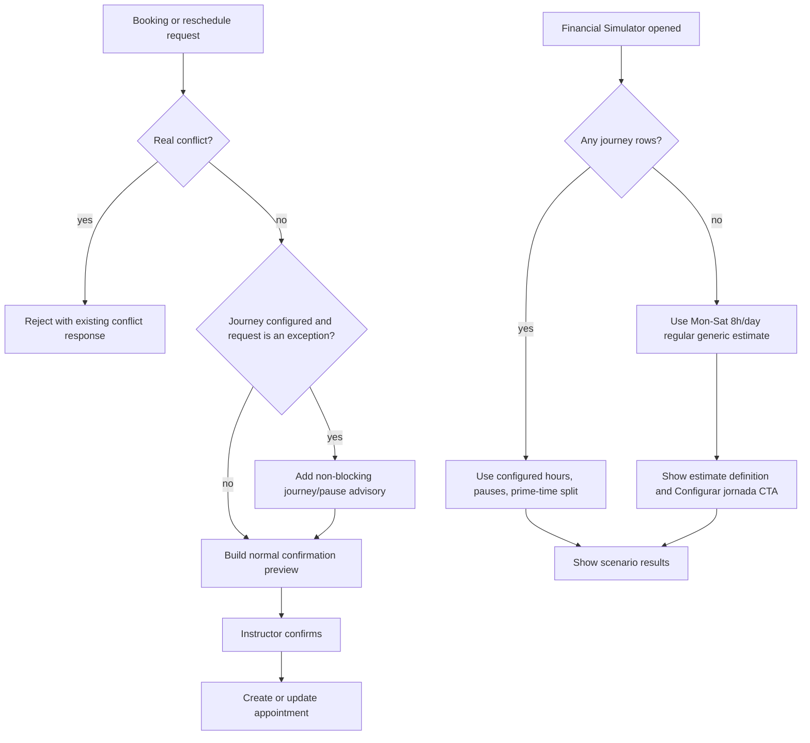

# Advisory Work Journey & Estimated Simulator Roadmap v0.1 — 2026-08-31

## Status

**Roadmap state:** proposed; no implementation has started.

Status notation:

- `[ ]` not started
- `[-]` in progress
- `[x]` completed and verified
- `[!]` blocked; record the blocker beside the item

## Executive decision

`WorkJourneyInterval` becomes an **advisory operating preference**, not a
hard booking boundary. A real scheduling conflict, invalid tenant-scoped
entity, place-resolution requirement, or group-capacity limit remains
blocking. A class outside the configured journey or a configured pause remains
valid when the instructor explicitly confirms it.

When no work journey is configured, the Financial Simulator remains usable in
an **estimated-capacity mode**. Its baseline is **8 regular-price hours per
working day, Monday through Saturday; Sunday is excluded** (48 hours per full
week). The result must visibly state that this is an estimate and direct the
instructor to **Configurações → Jornada de trabalho**. No default journey rows
are persisted.

## Product outcome

The instructor can record work that happens outside their usual hours without
fighting the product. The journey still makes the assistant's suggestions and
the financial model more useful, while a new tenant can explore the simulator
before completing configuration.

## Scope

### In scope

- Make journey and pause checks non-blocking for appointment creation,
  rescheduling, make-up redemption, waitlist fulfillment, and passive
  confirmation execution.
- Show an advisory in the active assistant's proposed-action confirmation when
  a requested time is outside a configured work interval or intersects a
  configured pause.
- Retain configured journey as the preferred range for open-time suggestions.
- Add the no-journey estimated baseline to the Financial Simulator only.
- Label the baseline, state its exact Monday–Saturday / 8h / regular-rate
  assumptions, and link to the journey configuration tab.
- Return typed metadata so the UI and persisted scenario snapshot can identify
  configured versus estimated capacity.
- Update tests and the authoritative documentation.

### Out of scope

- Persisting a default journey, automatically enabling days in Configurações,
  or overwriting any existing journey.
- Treating Sunday as a default working day.
- Inferring an exact daily time-of-day window or applying prime-time prices to
  unconfigured estimated capacity.
- Changing real calendar booking conflicts, place-stay resolution, group
  capacity, cancellation-notice rules, rates, or the `commercial_financials`
  entitlement.
- Applying estimated capacity to the standard Financeiro dashboard, make-up
  recommender, waitlist matching, or assistant free-time answers.

## Locked business rules

1. A configured journey and its pauses describe usual working preference;
   neither independently rejects an appointment.
2. Real busy-time conflicts remain hard failures and are still revalidated at
   proposal and execution time.
3. The assistant warns before confirmation, rather than silently accepting an
   exception or refusing it.
4. Open-ended availability questions continue to recommend only configured
   journey windows. When no journey exists, the assistant does not invent
   personal availability from the financial estimate.
5. The financial fallback exists only if the tenant has **zero**
   `WorkJourneyInterval` rows. A partially configured journey remains the
   instructor's source of truth; missing weekdays contribute zero configured
   capacity.
6. Estimated capacity is `480 * number_of_Monday_to_Saturday_dates` minutes per
   selected date range, with every minute classified as `regular` and generic
   (`Sem local definido`). Sunday contributes zero.
7. Existing configured capacity continues to use its actual hours, breaks,
   place attribution, and regular/prime rate resolution unchanged.
8. An estimated result is never presented as a personalized forecast and must
   carry an explicit configuration call to action.
9. Estimated capacity has no truthful clock-time or place allocation. The
   simulator may show aggregate metrics and potential, but must not render an
   invented event in `Agenda simulada`; the calendar asks for configuration
   instead.

## Why the fallback is regular-price, not an invented 09:00–17:00 interval

The simulator's configured calculation splits capacity by time of day to apply
regular versus prime rates. An unconfigured tenant has supplied neither a
working interval nor a reliable distribution of business hours. Assigning a
made-up clock interval would silently create prime-time assumptions. The
baseline therefore supplies volume only: generic capacity at the configured
regular rate. Configuring Jornada de trabalho is required before the simulator
can model the tenant's actual prime-time mix.

## Current-state touchpoint map

| Surface | Current implementation | Required change | Must remain unchanged |
|---|---|---|---|
| Shared appointment validation | `backend/app/services/appointments.py::assert_no_conflict` always calls `assert_within_work_journey`, which raises `409` after any journey row exists | Replace the exception-only check with a reusable journey-advisory evaluator; do not call it as a blocking validation | Appointment, event, recurring-class, and group-capacity conflict checks |
| Appointment service execution | `appointments.create_appointment` calls `assert_no_conflict` immediately before write | Ensure the executor permits an out-of-journey appointment while retaining race-condition conflict revalidation | Existing transition/audit creation and tenant scoping |
| Active-agent standard booking | `backend/app/agent/mutations.py::propose_create_appointment` checks conflicts before it creates a confirmation candidate | Add advisory text/structured context to the candidate preview; do not return an error solely for journey/pause | Place-resolution clarification and two-step propose-confirm-execute lifecycle |
| Active-agent make-up redemption | `propose_redeem_makeup_credit` uses the same shared conflict check | Surface the same non-blocking advisory in the preview | Credit eligibility, balance, and redemption transaction rules |
| Active-agent waitlist fulfillment | `propose_fulfill_waitlist_entry` uses the same shared conflict check | Surface the same advisory in the preview | Atomic eligibility/free-time validation and waitlist state transition |
| Passive confirmation | `services/passive_escalation.py` calls the standard create proposal path | Inherit the advisory through the standard proposal path; ensure it is not treated as unresolved/invalid data | Passive confidence, place-review, and user-confirmation policies |
| Calendar API | `backend/app/api/calendar.py` delegates to appointment creation | Direct calendar writes become valid outside journey automatically after the shared change | Auth, tenancy, schema validation, and conflict failures |
| Assistant instructions | `backend/app/agent/orchestrator.py` says direct proposals validate journey and tells the model to relay no-journey availability notes | Rewrite operational instructions: recommend journey windows, warn on an exception, and never claim a requested conflict-free slot is impossible because of journey | Entity resolution, date handling, group-vacancy routing, and confirmation requirements |
| Assistant availability tool | `backend/app/agent/tools.py::find_instructor_openings` derives openings from `compute_free_calendar_ranges`; without a journey it reports no opening | Keep configured-journey recommendation behavior. Do not reuse the financial fallback here; improve wording only if needed to explain configuration absence | Existing calendar/event subtraction and explicit-place filtering |
| Financial capacity primitive | `backend/app/services/financial_capacity.py::_load_net_work_ranges_by_day` returns empty ranges when no rows exist | Add a caller-selectable estimated-capacity path, without changing configured capacity behavior | Place-stay intersections and interval math for configured data |
| Analytics service | `financial_analytics._load_context`, `build_financial_dashboard`, and `evaluate_financial_scenario` share one context | Thread a capacity mode through only the simulator flow and emit source metadata | Standard dashboard semantics and existing scenario inputs |
| Financial analytics API | `GET /api/financial/dashboard` is shared by Financeiro and `/financeiro/simulador`; scenarios call `POST /api/financial/scenarios/evaluate` | Add a narrow, typed simulator-only capacity-mode parameter or dedicated simulator context endpoint; never silently change the regular dashboard's no-journey result | Feature guard, tenant scope, date-range validation, and existing response compatibility |
| Simulator page | `frontend/src/app/(protected)/financeiro/simulador/page.tsx` fetches the shared dashboard | Request estimated-capacity mode, pass metadata into the simulator, and render the setup banner/link | Date and place filters, scenario list, optimistic save behavior |
| Simulator components | `FinancialSimulator`, `ScenarioResults`, and `SimulatedAgenda` consume dashboard/scenario responses | Render the capacity-source explanation in the simulator context/results without duplicating business logic | Mix, occupancy, rate overrides, and simulated-agenda behavior |
| Simulated Agenda | `FinancialScenarioScheduleEvent` requires a date, place, start, and end time; `SimulatedAgenda` draws those events in FullCalendar | Do not fabricate event times/places for estimated capacity; show an estimate-only empty state and configuration CTA instead | Calendar rendering for configured scenarios and real-agenda read-only view |
| Financeiro dashboard | `financial-dashboard-section.tsx` shows a generic zero-capacity setup warning | Keep it configured-only. It must not show the simulator's estimate or imply the dashboard is personalized | Existing dashboard capacity calculations and messages |
| Configuration | `WorkJourneySection` manages real intervals and `minhas-regras/page.tsx` owns the route/tab | Add no new persisted defaults; expose a stable deep link/route target from simulator CTA and adjust copy to describe recommendations and financial capacity | Existing validation and financial audit log for saved configuration |
| Contracts | `backend/app/schemas/financial.py` and `frontend/src/lib/types.ts` define assumptions/result shapes | Add typed metadata for `configured` versus `estimated_default`, plus the displayable estimate definition | Existing response fields and saved historical scenario snapshots |
| Documentation | Business, capacity, page, and architecture docs describe journey as a hard boundary | Align the rule language and simulator behavior with this decision | Documentation of unrelated scheduling and revenue rules |

## Target design



### Advisory evaluator contract

Introduce one small internal result rather than retaining an exception-only
function:

```python
JourneyAdvisory(
    has_configured_journey: bool,
    outside_work_interval: bool,
    overlaps_break: bool,
)
```

The evaluator accepts the same tenant-scoped `professional_id`, `start_at`, and
`end_at` used today. It returns no advisory when no journey is configured or
when the full interval is within a configured work range and outside breaks.
It must handle an exception that both lies outside work time and intersects a
break without duplicating or contradicting the message.

The service layer may use this evaluator for data/preview composition, but
`assert_no_conflict` must no longer raise from it. This keeps one definition of
the preference while avoiding divergent behavior between chat and direct API
execution.

### Simulator capacity-mode contract

Use an explicit `capacity_mode` rather than making the shared dashboard infer
UI intent:

- `configured_only` — current behavior; used by Financeiro dashboard and its
  existing API consumers.
- `estimated_when_unconfigured` — used only by the simulator's context and
  scenario calculation paths. It returns the configured calculation whenever
  at least one journey interval exists, otherwise the agreed baseline.

The response should add a backwards-compatible metadata object, for example:

```json
"capacity_source": {
  "mode": "estimated_default",
  "configured": false,
  "working_days": [0, 1, 2, 3, 4, 5],
  "minutes_per_working_day": 480,
  "rate_basis": "regular",
  "configuration_path": "/minhas-regras"
}
```

For a configured result, return `mode: "configured"` and `configured: true`.
The explicit snapshot means saved scenarios remain interpretable after the
instructor later configures a real journey.

## Delivery phases

### [ ] Phase 0 — Lock contracts and reproduce the baseline

- [ ] Add focused regression cases that reproduce the current hard rejection:
  one direct service/API booking and one active-agent proposal outside a saved
  journey.
- [ ] Capture the current no-journey Financeiro dashboard and simulator result
  for a fixed Monday–Sunday range. Confirm that standard dashboard capacity is
  zero and the simulator cannot create useful capacity today.
- [ ] Confirm the selected regular-rate resolution order for generic capacity:
  generic default matrix first, then tenant-global fallback; retain `null` when
  neither is configured.
- [ ] Record representative dates containing Monday through Sunday, a partial
  range, and a cross-month range. These provide deterministic expected minutes
  for the estimate.
- [ ] Confirm the simulator CTA destination: `/minhas-regras` with the
  Jornada tab as its default active tab. Do not introduce a new route merely
  for deep linking.

**Verification:** the new tests fail against current hard-block behavior, and
the expected baseline is unambiguous: six eligible days in a full Monday–Sunday
week produce `2,880` estimated minutes.

### [ ] Phase 1 — Convert journey enforcement into advisory evaluation

**Primary files**

- `backend/app/services/appointments.py`
- `backend/tests/test_calendar_mutations.py`
- `backend/tests/test_instructor_events.py`

**Implementation**

- [ ] Replace `assert_within_work_journey(...)` with a side-effect-free helper
  such as `get_work_journey_advisory(...)`. Keep time-zone conversion and
  tenant filtering in this one location.
- [ ] Preserve the existing no-row semantics: no persisted journey means no
  scheduling advisory, not a fallback work interval.
- [ ] Make `assert_no_conflict(...)` check only actual appointment,
  instructor-event, and scheduled-class conflicts. Do not leave a hidden
  journey exception on a secondary execution path.
- [ ] Keep `create_appointment(...)` revalidating true conflicts immediately
  before persistence to preserve race-condition safety.
- [ ] Delete or rewrite stale docstrings/comments that say appointment creation
  “honors” or “rejects outside” the journey.

**Behavioral checks**

- [ ] Booking inside configured work time is accepted without advisory.
- [ ] Booking outside a configured interval is accepted and produces an
  `outside_work_interval` advisory.
- [ ] Booking during a configured pause is accepted and produces an
  `overlaps_break` advisory.
- [ ] Booking on an unconfigured weekday after another weekday was configured
  is accepted and produces an out-of-journey advisory.
- [ ] An overlapping appointment, event, or class still returns the existing
  `409` response.
- [ ] Instructor-event behavior remains unchanged; it was already exempt from
  journey enforcement.

**Verification:** run the focused calendar and instructor-event tests under
the required environment:

```bash
conda run -n agenda pytest backend/tests/test_calendar_mutations.py backend/tests/test_instructor_events.py -q
```

### [ ] Phase 2 — Carry the advisory through every booking experience

**Primary files**

- `backend/app/agent/mutations.py`
- `backend/app/agent/orchestrator.py`
- `backend/app/services/passive_escalation.py`
- `backend/app/api/calendar.py`
- `frontend/src/components/assistant/assistant-panel.tsx`
- `frontend/src/components/assistant/floating-chat.tsx`
- `frontend/src/components/calendar/week-calendar.tsx`
- `backend/tests/test_calendar_mutations.py`
- `backend/tests/test_agent.py`
- `backend/tests/test_assistant_api.py`

**Implementation**

- [ ] At each proposal creator — standard appointment, make-up redemption, and
  waitlist fulfillment — evaluate journey preference after parsing the time
  and before persisting the action candidate.
- [ ] Add the advisory to candidate preview data in a typed, renderable field;
  do not concatenate hidden operational data into an error string.
- [ ] Use consistent Portuguese copy. Proposed preview text:

  > Fora da sua jornada configurada. O agendamento pode continuar, mas revise
  > o horário antes de confirmar.

  If it overlaps a pause, state `Durante uma pausa configurada` instead. When
  both conditions apply, use one compact combined notice.
- [ ] Update the agent system instruction so a direct, conflict-free request
  results in a normal confirmation proposal with the advisory, rather than a
  refusal. The assistant must not make the configuration CTA sound mandatory
  to complete that booking.
- [ ] Keep `find_instructor_openings` scoped to configured journey. Its
  no-journey note should say that recommended openings cannot yet be shown and
  point to Configurações; it must not say the agenda is full.
- [ ] Confirm direct Calendar creation/execution has no user-visible hard
  error. If the calendar supports a creation preview, render the same advisory
  there; otherwise do not add a second confirmation flow in this roadmap.
- [ ] Ensure passive handling does not classify an otherwise valid external
  appointment as an ambiguity merely because it is an out-of-journey
  exception.

**Verification**

- [ ] Agent proposal outside journey creates one candidate with advisory copy.
- [ ] Confirmation executes successfully outside journey.
- [ ] Make-up and waitlist paths retain their transaction/credit semantics and
  expose the same advisory.
- [ ] A true scheduling conflict still produces no candidate.
- [ ] A generic assistant answer to “when am I free?” stays limited to the
  configured journey and does not borrow the simulator baseline.

### [ ] Phase 3 — Add isolated estimated capacity to the simulator backend

**Primary files**

- `backend/app/services/financial_capacity.py`
- `backend/app/services/financial_analytics.py`
- `backend/app/schemas/financial.py`
- `backend/app/api/financial_analytics.py`
- `backend/tests/test_financial.py`

**Implementation**

- [ ] Define constants in the financial-capacity domain for the estimated
  working weekdays `(0, 1, 2, 3, 4, 5)`, `480` minutes per day, and regular
  rate classification. Do not scatter literal values across API and UI.
- [ ] Add a narrowly scoped helper that detects whether the professional has
  any work-journey rows. It must not confuse “configured only on Mondays” with
  “not configured.”
- [ ] Add a separate estimated aggregate-capacity calculation for each eligible
  date when — and only when — `capacity_mode=estimated_when_unconfigured` and
  zero rows exist. Do not manufacture `CapacitySegment` clock times or places
  merely to reuse the visual agenda contract.
- [ ] Ensure potential calculations and scenario generation value estimated
  capacity through `PricingRules.resolve(None, "regular", participant_count)`.
  It must never select a named-place rate or a prime rate.
- [ ] In estimated mode, return aggregate scenario metrics and an empty
  `simulated_schedule`. This is intentional: there is no real day/time/place
  allocation to draw before the journey is configured.
- [ ] Preserve standard `build_financial_dashboard(...)` behavior by default.
  Add an optional typed parameter with the default `configured_only` and pass
  it through `_load_context(...)`, dashboard construction, and scenario
  evaluation.
- [ ] Extend `FinancialAnalyticsAssumptions`, dashboard detail, and scenario
  result schema with the capacity-source metadata. Ensure saved scenario
  snapshots include it automatically through the existing `result_snapshot`.
- [ ] Add `capacity_mode` to `GET /api/financial/dashboard` and to the scenario
  input contract, or introduce a dedicated simulator-context endpoint if this
  keeps the scenario contract cleaner. Choose one approach and document it;
  do not apply estimate mode implicitly based on route headers or client name.
- [ ] Reject unknown capacity-mode values through Pydantic/FastAPI validation.

**API compatibility**

- Existing `/api/financial/dashboard` consumers omit `capacity_mode` and
  retain `configured_only` behavior.
- The existing `FinancialScenarioInput` retains all fields; any new mode field
  has a safe default and is snapshot-persisted.
- No migration is needed: the estimate derives from request dates and the
  absence of journey rows.

**Verification**

- [ ] Standard dashboard returns zero capacity for an unconfigured tenant,
  exactly as before.
- [ ] Simulator mode returns `480 * eligible_days` minutes for an
  unconfigured tenant, with `estimated_default` metadata.
- [ ] Sunday-only period returns zero estimated minutes.
- [ ] Monday–Saturday range returns `2,880` minutes; a Monday–Sunday range
  returns the same amount.
- [ ] A partially configured journey never blends real and default capacity;
  it uses configured-only data and reports `configured`.
- [ ] Estimated generic capacity follows generic/default rate resolution,
  honors explicit temporary regular-rate overrides, and never receives prime
  pricing.
- [ ] Place-filtered simulator behavior is defined explicitly. Recommended
  contract: estimate mode is available only for “Todos os locais,” because
  generic capacity cannot truthfully be attributed to a selected place; a
  selected-place result remains zero until that place has configured capacity.

### [ ] Phase 4 — Make estimated mode explicit in the simulator UI

**Primary files**

- `frontend/src/app/(protected)/financeiro/simulador/page.tsx`
- `frontend/src/components/financial/financial-simulator.tsx`
- `frontend/src/components/financial/scenario-results.tsx`
- `frontend/src/components/financial/simulated-agenda.tsx`
- `frontend/src/lib/api.ts`
- `frontend/src/lib/types.ts`
- `frontend/src/app/(protected)/minhas-regras/page.tsx`

**Implementation**

- [ ] Extend `fetchFinancialDashboard(...)` with a typed optional capacity
  mode, and have the simulator page request `estimated_when_unconfigured` on
  its initial load and each date/place filter refresh.
- [ ] Ensure `FinancialSimulator.buildInput()` sends the same mode to evaluate
  and save endpoints. This prevents the summary context and evaluated scenario
  from using different capacity assumptions.
- [ ] Render the following information card above the simulator assumptions
  when response metadata says `estimated_default`:

  > **Jornada estimada**
  >
  > Você ainda não configurou sua jornada de trabalho. Para uma projeção
  > personalizada, configure-a em **Configurações → Jornada de trabalho**.
  >
  > Enquanto isso, esta simulação considera **8 horas por dia, de segunda-feira
  > a sábado (48 horas por semana)**, avaliadas pela **tarifa regular**.

- [ ] Add a visible `Configurar jornada` link/button to `/minhas-regras`.
  It must be keyboard accessible, retain the user’s current route state only
  when that is already a project convention, and not create a new setup
  wizard.
- [ ] Show a compact `Estimativa` badge alongside financial results and saved
  scenario entries derived from estimated mode. The badge must describe the
  stored snapshot, not re-evaluate the scenario against a newly saved journey.
- [ ] In `SimulatedAgenda`, show a purpose-built empty state for estimated
  mode: explain that aggregate capacity is available but a time/place agenda
  requires a configured journey. Repeat the configuration CTA. Do not render
  00:00, 08:00, or any other invented event time.
- [ ] When metadata says `configured`, omit the estimate card and preserve the
  current Agenda simulada behavior.
- [ ] For a selected place with an unconfigured journey, use the locked Phase
  3 contract: explain that estimated generic capacity cannot be assigned to a
  specific place; offer “Todos os locais” and `Configurar jornada` instead of
  showing a misleading zero without context.
- [ ] Do not change the standard Financeiro dashboard's generic no-capacity
  alert in this phase. It is intentionally separate from simulator onboarding.

**UX and accessibility checks**

- [ ] The estimate card is visible without opening a tooltip or details panel.
- [ ] Its prose states all four assumptions: unconfigured journey, 8h,
  Monday–Saturday, and regular rate.
- [ ] The CTA has an accessible name and works at narrow/mobile widths.
- [ ] Loading/filter transitions preserve the currently displayed estimate or
  configured result until replacement succeeds, consistent with the project's
  optimistic/no-unnecessary-spinner UI policy.
- [ ] A failed refresh retains the previous result and shows the existing safe
  error state; it never shows estimated metadata attached to stale configured
  figures.

### [ ] Phase 5 — Align documentation, contracts, and regression coverage

**Documentation files**

- `docs/business_rules.md`
- `docs/capacity_and_recommendations.md`
- `docs/pages/minhas_regras.md`
- `docs/pages/simulador_financeiro.md`
- `docs/ontology_chat_architecture.md`
- `docs/data_architecture.md` (only the references that claim hard journey
  validation)
- `docs/architecture_overview.md`
- `README.md`

**Documentation changes**

- [ ] Replace “appointments must fall within” and similar hard-boundary
  statements with the advisory/override rule, while documenting unchanged
  real-conflict enforcement.
- [ ] State that `find_instructor_openings` remains a configured-journey
  recommendation tool and does not use financial defaults.
- [ ] Document simulator-only estimated capacity, its Monday–Saturday 8h/day
  regular-rate calculation, Sunday exclusion, absence-of-rows trigger, and
  no fabricated simulated-agenda slots.
- [ ] Document that partial journey configuration is authoritative and never
  supplemented with default weekdays.
- [ ] Link this roadmap in README’s “Roadmaps & Guides” section.

**Regression test matrix**

| Layer | Required coverage |
|---|---|
| Appointment service/API | Out-of-journey and pause appointments succeed; all true overlap checks still fail; tenant isolation remains intact |
| Agent mutation | Standard booking, make-up redemption, waitlist fulfillment, and passive escalation create a warning-bearing candidate and execute successfully when conflict-free |
| Agent response contract | General openings use real configured journey only; direct out-of-journey requests receive a confirmation advisory, never a journey-based refusal |
| Financial API | Default dashboard remains configured-only; simulator mode returns exact estimate metadata/minutes; invalid mode is rejected; scenario evaluation and saved snapshots retain mode |
| Financial calculations | Mon–Sat count, Sunday exclusion, date boundaries, partial journey precedence, generic regular pricing, rate override handling, missing-rate behavior, and selected-place behavior |
| Frontend | Estimate banner/copy/CTA, configured-mode absence of banner, simulated-agenda estimate empty state, scenario snapshot badge, filter transitions, and error rollback |
| Regression suite | Existing journey setup/audit endpoints, instructor events, group capacity, capacity presets, and revenue analytics remain behaviorally compatible |

**Verification commands**

```bash
conda run -n agenda pytest backend/tests/test_calendar_mutations.py backend/tests/test_agent.py backend/tests/test_assistant_api.py backend/tests/test_financial.py -q
conda run -n agenda pytest backend/tests -q --ignore=backend/tests/test_extraction.py
```

Run the frontend's repository-defined typecheck/lint/build commands after the
API contract change. Do not add a package merely to test this UI; use the
existing frontend validation toolchain.

## Migration, audit, and security impact

### Database and migration

No database migration is required.

- `WorkJourneyInterval` continues to store only deliberately configured work
  intervals and pauses.
- The estimated baseline is derived in memory from the requested date range
  and never creates rows, audit entries, appointments, or recurring slots.
- Existing `FinancialScenario.result_snapshot` JSON will naturally preserve
  the new source metadata for newly saved scenarios. Historical rows lack the
  field and should be rendered as legacy configured-only snapshots, not
  rewritten.

### Audit trail

- Existing work-journey replacement audit records remain unchanged.
- Appointment creation remains audited through the existing transition and
  operational-event paths. An advisory does not create a separate audit event
  in this release; the accepted appointment is already the authoritative fact.
- Saved scenario input/result snapshots record the selected capacity mode and
  result source, making estimate-based commercial decisions reviewable.

### Security and tenancy

- Every evaluator/query continues to receive `professional_id` from the
  authenticated tenant context. Default capacity must never be shared or
  cached across tenants.
- The new query/body mode is not an authorization bypass: all financial
  endpoints keep `require_commercial_financials`, and schedule writes retain
  authenticated tenant checks.
- Treat the mode as a closed enum. Do not accept arbitrary strings that could
  alter hidden analytics behavior.
- Do not expose an arbitrary redirect URL in the CTA metadata; use the fixed,
  internal `/minhas-regras` route.

## Delivery sequence and release gate

1. Complete Phase 0 and agree on the selected-place estimate contract before
   modifying the financial API.
2. Complete Phase 1 first. It is isolated from financial behavior and proves
   that the only scheduling change is removing journey as a blocker.
3. Complete Phase 2 and verify assistant/direct/passive paths all use the same
   advisory semantics.
4. Complete Phase 3 backend contracts and tests before changing the simulator
   UI. This prevents copy-driven assumptions from diverging from calculations.
5. Complete Phase 4, then perform a manual walkthrough in a tenant with no
   journey, a partial journey, and a full Monday–Saturday journey.
6. Complete Phase 5 documentation and the focused/full regression suite.
7. Review the changed API schema, scenario snapshot, UI copy, and test results
   before any remote deployment. Develop and validate locally; do not make
   destructive changes to the Azure remote PostgreSQL database.

## Acceptance criteria

The work is complete only when all statements below are true:

- [ ] A conflict-free appointment, make-up redemption, waitlist fulfillment,
  and passive confirmation can be created outside configured work time and
  during a configured pause.
- [ ] Those exceptions are visibly flagged before instructor confirmation in
  the active assistant, without making confirmation impossible.
- [ ] Existing conflict, place, group-capacity, and tenant-isolation
  protections still reject invalid requests.
- [ ] The assistant recommends configured journey windows for open-ended
  availability, but does not derive those recommendations from financial
  fallback capacity.
- [ ] An unconfigured tenant can evaluate and save a simulator scenario using
  exactly 8 Monday–Saturday regular-price hours per eligible date.
- [ ] The simulator visibly tells the user to configure Jornada de trabalho
  and explicitly states the assumed journey: 8h/day, Monday–Saturday,
  48h/week, regular rate.
- [ ] No estimated capacity is persisted as a `WorkJourneyInterval`, assigned
  to a named place, charged at prime price, or drawn as a real-looking
  scheduled time.
- [ ] A tenant with any configured journey retains configured-only financial
  capacity; the platform never silently fills their unspecified weekdays with
  default hours.
- [ ] The normal Financeiro dashboard remains configured-only unless a later,
  separately approved product decision expands estimate mode there.
- [ ] Backend and frontend contracts compile, focused tests pass, full
  non-extraction backend regression passes, and all referenced documentation
  matches the shipped behavior.

## Decisions that require confirmation before implementation

Only one product choice remains deliberately open because it changes the
meaning of a place-filtered forecast:

| Decision | Recommended answer | Reason |
|---|---|---|
| What should happen when an unconfigured tenant selects one named place in the simulator? | Do not allocate the default estimate to that place; explain that a journey/place configuration is required for a place-specific forecast | The default has neither a place nor a time and attributing it would overstate that venue's potential |

All other product decisions are locked by this roadmap: advisory scheduling,
Monday–Saturday 8h/day baseline, Sunday excluded, regular-rate valuation,
simulator-only fallback, and an explicit configuration message/CTA.
