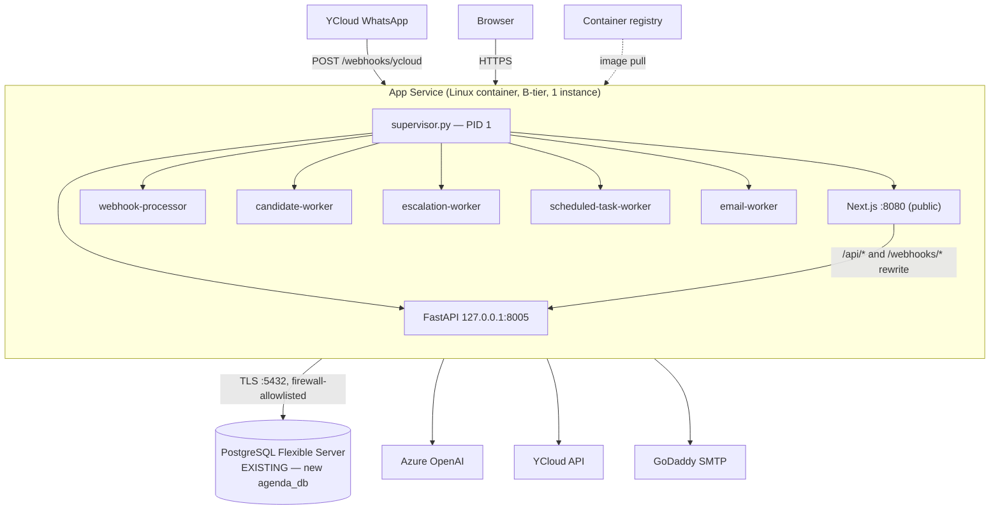
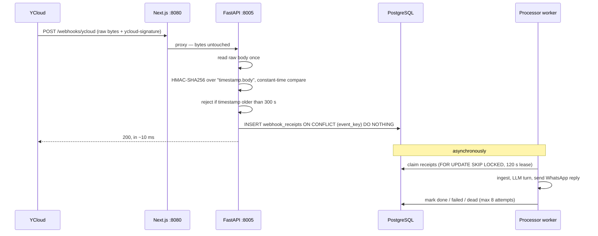

# Azure Deployment Roadmap — lean MVP

- **Created:** 2026-09-04
- **Status:** implementation in progress; the Azure schema migration is
  complete. Image publication, App Service deployment, and domain binding
  remain operator-owned.
- **Guiding constraint:** **simplest and cheapest deployment that is not negligent.**
- **Supersedes:** the WebJobs / Key Vault / VNet / Front Door shape proposed in
  [azure_app_service_postgresql_deployment_assessment.md](azure_app_service_postgresql_deployment_assessment.md).
  That document remains useful as background and as the *growth* path; this
  roadmap is what we actually build first.

> **Rule for this rollout:** everything here is additive or local. No existing
> Azure database is dropped, overwritten, or migrated destructively.

### Implementation progress — 2026-09-04

- Phase 1 items 5.1–5.8 are implemented in the working tree and their
  bounded regression tests pass against an isolated PostgreSQL 18.6 database.
- The complete Alembic chain successfully applies to the project-local,
  isolated PostgreSQL 18.6 Compose database.
- The remote `agenda_db` has `pg_trgm` 1.6 installed and Alembic revision
  `d4e5f6a7b8c9` applied (46 public tables).

---

## 1. What "cheap and simple" means here

Every component in the earlier assessment was individually defensible, but
together they add up to roughly a dozen Azure resources and a multi-week
infrastructure project before the first customer message arrives. For an MVP
with one developer and low traffic, most of that cost is *complexity*, not
money.

This roadmap deliberately removes six things and accepts the consequences:

| Removed | Instead | Consequence we accept |
|---|---|---|
| Five continuous WebJobs + one triggered WebJob | The existing supervisor starts the five workers **in the same container** | Workers share CPU/RAM with the web process. One restart cycles everything. |
| Azure Container Apps | — | No independent worker scaling until we need it. |
| Azure Key Vault | App Service **application settings** | Secrets are visible to anyone with portal access to the app. Acceptable for a solo/small team; revisit before adding staff. |
| VNet integration + private DNS + private endpoints | Public PostgreSQL endpoint + **firewall rules** + TLS | Database is reachable from allowlisted IPs only, not fully private. |
| Deployment slots (needs Standard ~$70/mo) | Deploy = container restart | ~30–60 s of downtime per deploy. Deploy off-peak. |
| Front Door + WAF | App Service managed TLS only | No managed WAF or edge rate limiting yet. |

Each of these is a **one-way door we deliberately left unlocked**: every one can
be added later without rewriting application code. The order of re-introduction
is in Section 9.

**What we are *not* cutting**, because these are correctness and security, not
polish:

- webhook signature verification and the durable receipt ledger (already built);
- `DEBUG=false` enforcement and production config validation;
- TLS to the database, HTTPS-only ingress, CSRF, secure cookies;
- a real backup/restore rehearsal before cutover.

---

## 2. Target architecture



**Total Azure resources: three.** The App Service (plan + app), the container
registry, and the PostgreSQL server *we already have*.

### Deployment model reference

This follows the practical deployment shape used by the sibling
[`horah`](../../horah) project: one non-root production image, a small
entrypoint, an optional database-reachability wait, a public health endpoint,
and configuration injected at runtime through App Service settings. Agenda
keeps its own supervisor rather than copying HoraH's `combined_main.py`,
because Agenda must run a standalone Next.js server and FastAPI as separate
processes in the same container.

### Why one container for everything

The image already supports this. [scripts/deploy/entrypoint.sh](../scripts/deploy/entrypoint.sh)
selects a workload with `ROLE`, and [scripts/deploy/supervisor.py](../scripts/deploy/supervisor.py)
already supervises multiple children and exits if any dies. Running the five
workers as five more supervised children is a small, contained change to the
supervisor — not new infrastructure.

The honest trade-off: the candidate worker makes LLM calls and can be
memory-hungry. If it starves the web process, the fix is a bigger plan tier
(a slider, not a redesign) or moving that one worker out.

---

## 3. Verified findings

Everything in this section was **checked against the running system or the
actual code** on 2026-09-04, not assumed.

### 3.1 The Azure PostgreSQL server (read-only inventory)

Initial inventory used the credentials in `.env` and read-only queries. The
subsequent additive database setup is recorded in the updated rows below.

| Property | Value | Implication |
|---|---|---|
| Server type | **Flexible Server** (plain username, not `user@server`) | Current, supported. Not the retired Single Server. |
| Version | **PostgreSQL 18.6** | Newer than the PG 16 the assessment assumed. See 3.2 — this is a real risk. |
| Databases present | only `postgres`, `azure_sys`, `azure_maintenance` | **The server is empty.** No other project shares it. No co-tenancy risk. |
| `agenda_db` | **migrated** | `pg_trgm` 1.6 and Alembic revision `d4e5f6a7b8c9` are installed. |
| `max_connections` | **429** | Generous. Our worst case (~90) fits easily. Not a burstable-micro SKU. |
| Admin role | `tennisosadmin`, member of `azure_pg_admin` | Can create databases, roles, and extensions. Not superuser (normal for Azure). |
| `azure.extensions` | includes **`PG_TRGM`** | Required extension is allowlisted. |
| `ssl_min_protocol_version` | TLSv1.2 | Good. Connect with `sslmode=require`. |
| Server timezone | UTC | See 3.6. |

Because this server already exists and is empty, **reusing it is free** and is
the single biggest cost saving available. It removes an entire provisioning
step from the roadmap.

### 3.2 PostgreSQL 18 is untested for this application — highest-risk unknown

The server is on **18.6**. The application pins `psycopg2-binary==2.9.10` and
`sqlalchemy==2.0.41`, and the full test suite has only ever run against the
local development Postgres. The wire protocol is stable and this will *probably*
work, but "probably" is not a deployment strategy — and the schema uses
non-trivial features (UUID, JSONB, partial indexes, `FOR UPDATE SKIP LOCKED`,
`pg_trgm`, timezone-aware timestamps).

All 361 backend tests have passed against PostgreSQL 18.6, including the full
Alembic chain and the 13 Azure OpenAI extraction-fixture cases. This removes
the PostgreSQL 18 compatibility gate before cutover.

The local dev Postgres container was not running during this review, so
dev/prod version parity is currently **unknown**. Align local to 18 so the two
environments stop diverging.

### 3.3 `pg_trgm` allowlist and extension — complete

The schema needs `pg_trgm`. Azure Flexible Server requires it to be allowlisted
in the `azure.extensions` server parameter before `CREATE EXTENSION` is
permitted. The parameter now includes `PG_TRGM`, the extension is installed at
version 1.6 in `agenda_db`, and the complete Alembic migration has succeeded.

### 3.4 Repository is now release-traceable

The application foundation, including the `Dockerfile`, deployment scripts,
webhook queue, migrations, and tests, is committed. The current deployment
hardening implementation is intentionally still in the working tree and must
be committed before an image is built.

Every image must still be built from an explicit commit and tagged with that
commit SHA. Record its immutable digest after the ACR push; the commit tag and
digest together make a deployment reproducible and rollback-safe. This roadmap
document itself should be added to the next documentation commit.

### 3.5 Application-layer gaps (verified in code)

| # | Finding | Evidence | Severity |
|---|---|---|---|
| A | `/webhooks/*` is **not reachable from the internet**. Next.js proxies only `/api/:path*`, so YCloud gets a 404 on every message. | [frontend/next.config.ts](../frontend/next.config.ts#L18-L23) | **Blocker** |
| B | **No request body size limit.** `await request.body()` reads the whole payload into memory *before* signature verification, so an unauthenticated caller can OOM the container. | [backend/app/api/whatsapp.py](../backend/app/api/whatsapp.py#L47) | **P0 security** |
| C | **No health path on the public port.** App Service Health Check would 404 forever and recycle the instance in a loop. | [backend/app/main.py](../backend/app/main.py#L163-L165) | **Blocker** |
| D | **Security headers never reach the browser.** The middleware runs on FastAPI, which only serves `/api/*` and `/webhooks/*`. Every HTML page is served by Next.js, which sets **no** CSP, HSTS, or X-Frame-Options. | [backend/app/main.py](../backend/app/main.py#L110-L129), [frontend/next.config.ts](../frontend/next.config.ts) | **P0 security** |
| E | **Rate limiter buckets every user together.** It keys on `request.client.host`, but behind the Next.js proxy that is always `127.0.0.1`, and uvicorn runs without `--proxy-headers`. One noisy client locks out all tenants; audit logs record the wrong IP. | [backend/app/main.py](../backend/app/main.py#L77), [scripts/deploy/supervisor.py](../scripts/deploy/supervisor.py#L32-L43) | **P0** |
| F | **`DEBUG` is not validated in production.** `DEBUG=true` simultaneously accepts **unverified webhooks** and mounts the `dev_mock` router — a full auth bypass from one typo in a portal field. | [backend/app/core/settings.py](../backend/app/core/settings.py#L73-L90) | **P0 security** |
| G | **Naive dates shift by a day.** `date.today()` / `datetime.now()` resolve to UTC in the container but BRT locally, so between 21:00 and midnight São Paulo time "today" is already tomorrow. | [backend/app/services/makeup_recommender.py](../backend/app/services/makeup_recommender.py#L164), [backend/app/services/makeup_credits.py](../backend/app/services/makeup_credits.py#L203) | **P0 correctness** |
| H | `.dockerignore` patterns are root-relative, so `frontend/.env.local` **is** copied into the build. It is empty today, but any `NEXT_PUBLIC_*` value placed there ships silently in the public JS bundle. | [.dockerignore](../.dockerignore) | P1 hygiene |

Good news, verified: `.env` is gitignored, untracked, and **has never been
committed**; Alembic has a **single clean head** (`d4e5f6a7b8c9`, 60 files);
`tzdata` **is** present in `python:3.11-slim-bookworm`, so `ZoneInfo` works.

### 3.6 Corrections to the earlier assessment

- **Security headers are *not* merely "P1 not started".** They are implemented
  but on the wrong process, so the browser never receives them (finding D).
- **Do not wire a dependency-aware readiness probe to App Service Health
  Check.** Health Check *recycles* failing instances; a database blip or HA
  failover would then restart your only instance and turn a recoverable
  hiccup into an outage. Health Check gets a **shallow** liveness path;
  a separate `/api/ready` with dependency checks is for smoke tests and
  alerting only.
- **`WEBHOOK_TASK_QUEUE` has no `receipt` value** in the assessment's sense;
  valid values were `local`, `cloud_tasks`, `gcp`. After the GCP cleanup only
  `local` (and the alias `receipt`) remain.
- **WebJobs on Linux containers are supported** (the assessment hedged heavily);
  only Alpine-based images are excluded, and ours is Debian. We are skipping
  them anyway for the reason in Section 2 — but the hedge was unnecessary.
- **PG 16 was assumed; the server is on 18.6.** Section 3.2.

---

## 4. Cost

Azure infrastructure only, USD/month, before tax. Excludes YCloud, SMTP,
domain, Langfuse, and Azure OpenAI tokens. Confirm exact Brazil South prices in
the Pricing Calculator inside the credited subscription — these are planning
figures, not quotes.

| Component | Choice | USD/mo |
|---|---|---:|
| App Service plan | **B1** Linux (1 vCPU, 1.75 GB) | ~13 |
| Container registry | **ACR Basic** | ~5 |
| PostgreSQL Flexible Server | **already provisioned and paid for** | 0 extra |
| TLS certificate | App Service managed, free | 0 |
| Logs | App Service log stream / small Log Analytics cap | 0–5 |
| **Total additional** | | **~18–23** |

Notes and levers:

- **B1 is the chosen starting tier.** Seven processes (Next.js + FastAPI +
  five workers) plausibly land near 1.2–1.5 GB against B1's 1.75 GB, so measure
  peak RSS during the container verification. Move to **B2** (3.5 GB, ~$26)
  only if that measurement shows B1 is too tight; this is a slider, not a
  redesign.
- **B-tier has no deployment slots.** That is the trade for the price; deploys
  are a container restart.
- **ACR Basic can be dropped to $0** by using GitHub Container Registry with a
  pull secret instead. Saves $5/mo at the cost of App Service's native
  managed-identity ACR integration. Take it only if $5 matters.
- The existing PostgreSQL server reports `max_connections=429`, so it is not a
  micro SKU and someone is already paying for it. Confirm what it costs and
  whether it can be downsized — **this is likely the largest line item in the
  whole deployment**, and it is not in the table above because it predates this
  project.

---

## 5. Phase 1 — application changes (do these first, all local)

All of these are verifiable on your laptop before any Azure spend. Each ships
with a test, per `AGENTS.md`.

### 5.0 Select the release commit

The repository commit gate is complete. Before building, select the exact
release commit SHA; use it as the image tag and record the image digest after
publishing. Do not build a production image from an uncommitted working tree.

### 5.1 Route `/webhooks/*` and a health path to FastAPI

Findings A and C. Add to `rewrites()` in [frontend/next.config.ts](../frontend/next.config.ts):

```ts
{ source: "/webhooks/:path*", destination: `${API_URL}/webhooks/:path*` },
{ source: "/healthz",         destination: `${API_URL}/health` },
```

`/healthz` becomes the App Service Health Check path. Proxying it is
deliberate: a 200 proves **both** that Next.js is serving and that FastAPI is
alive — one probe covers both critical processes.

**Verify:** in the built container, a signed webhook returns 200 and
`GET /healthz` returns 200 on port 8080.

### 5.2 Cap the webhook body size

Finding B. In [backend/app/api/whatsapp.py](../backend/app/api/whatsapp.py),
reject on `Content-Length` above ~1 MB **before** `await request.body()`.

**Verify:** a 5 MB POST is rejected without being buffered; a normal payload
still passes signature verification byte-for-byte.

### 5.3 Send security headers from Next.js

Finding D. Add a `headers()` block to [frontend/next.config.ts](../frontend/next.config.ts)
covering CSP, HSTS, `X-Frame-Options: DENY`, `X-Content-Type-Options`, and
`Referrer-Policy` for HTML routes. Keep the existing FastAPI middleware as-is
for `/api/*`.

**Verify:** `curl -I` on the login page shows the headers.

### 5.4 Fix client IP resolution

Finding E. Add `--proxy-headers --forwarded-allow-ips=127.0.0.1` to the uvicorn
arguments in [scripts/deploy/supervisor.py](../scripts/deploy/supervisor.py)
so `X-Forwarded-For` from the Next.js proxy is trusted.

**Verify:** the rate limiter distinguishes two different client IPs through the
full proxy chain instead of collapsing them to `127.0.0.1`.

### 5.5 Refuse to boot with `DEBUG=true` in production

Finding F. Add the assertion to `validate_startup_settings()` in
[backend/app/core/settings.py](../backend/app/core/settings.py).

**Verify:** `ENVIRONMENT=production DEBUG=true` fails at startup with a clear
message.

### 5.6 Pin the application timezone

Finding G. Set `TZ=America/Sao_Paulo` in the [Dockerfile](../Dockerfile).

This is the surgical fix: it makes the container behave like the dev machine
without touching business logic. The deeper fix — making those three call sites
timezone-explicit — is worth doing later, but not during a cutover.

**Verify:** a test that freezes the clock at 22:30 BRT and asserts
`date.today()` is still the São Paulo date.

### 5.7 Supervise the five workers

Extend [scripts/deploy/supervisor.py](../scripts/deploy/supervisor.py) to also
start the five worker modules as children when `RUN_WORKERS=true`, reusing the
existing terminate-and-exit behaviour.

Keep it behind a flag so `ROLE=platform` without workers stays available — that
is the escape hatch if we later split workers onto their own compute.

**Verify:** all seven processes start in the container; killing any one causes
the supervisor to exit non-zero; measure peak RSS to choose B1 vs B2.

### 5.8 Tighten `.dockerignore` and pool defaults

Finding H: add `**/.env` and `**/.env.*`. Separately, set `DB_POOL_SIZE=2` and
`DB_MAX_OVERFLOW=1` in the production settings — the defaults (5 + 10 per
process × 7 processes) would request far more connections than needed.

### 5.9 Run the test suite against PostgreSQL 18

Finding 3.2, and the gate for everything after it. Point a local PG 18
container at the suite and get a clean pass before provisioning anything. The
repository provides this as the `postgres` Compose service: `docker compose up
-d` starts `agenda_ai_local_pg` on `127.0.0.1:55432`, with an isolated volume.
Run the Alembic migration once for a new volume before running the suite.

---

## 6. Phase 2 — Azure setup

Ordered so that each step is verifiable and nothing is destructive.

### Step 1 — Create the `agenda_db` database — complete

On the **existing** Flexible Server, create a new, empty database. Do not touch
`postgres`, `azure_sys`, or `azure_maintenance`.

The database name is confirmed as **`agenda_db`**, for both local and remote
environments. The remote database now has the full Alembic schema.

### Step 2 — Allowlist `pg_trgm` — complete

The `azure.extensions` server parameter now includes `PG_TRGM`, and `pg_trgm`
1.6 is installed in `agenda_db`.

**Verified:** `CREATE EXTENSION pg_trgm` succeeded, followed by Alembic
revision `d4e5f6a7b8c9`.

### Step 3 — Firewall

Add two rules: your workstation IP (for migrations and inspection) and
*Allow Azure services* (so App Service can connect). Nothing else.

### Step 4 — Build and publish the image (operator-owned)

The project provides the Dockerfile; image generation, publishing to Azure
Container Registry, and deployment are performed by the project owner through
the Azure CLI. Build from the release commit selected in Section 5.0, tag with
that commit, and deploy the resulting immutable digest — never `latest`.

### Step 5 — Configure the existing App Service with the image (operator-owned)

The Linux B1 App Service is already deployed. Using the Azure CLI, configure
that existing app to pull the image digest from Step 4; do not provision a
second Web App. Revisit the plan size only if the 5.7 peak-RSS measurement
shows B1 is too tight.

Required settings:

| Setting | Value |
|---|---|
| `WEBSITES_PORT` | `8080` |
| `PORT` | `8080` |
| `INTERNAL_API_PORT` | `8005` |
| `INTERNAL_API_URL` | `http://127.0.0.1:8005` |
| `ROLE` | `platform` |
| `RUN_WORKERS` | `true` |
| `ENVIRONMENT` | `production` |
| `DEBUG` | `false` |
| `DATABASE_URL` | full TLS URL (`sslmode=require`) |
| `WEBHOOK_INLINE_PROCESSING` | `false` |
| `TZ` | `America/Sao_Paulo` |

Plus the secrets and tuning values inventoried in Section 7 of the
[background assessment](azure_app_service_postgresql_deployment_assessment.md#7-configuration-and-secret-inventory).

Enable **Always On**, **HTTPS Only**, and set **Health Check** to `/healthz`.

> Do **not** copy the root `.env` into App Service. It contains development and
> legacy values (`PG_LOCAL_*`, `AZURE_PG_*`) that production code does not read
> and must not inherit. Build the settings list explicitly.

### Step 6 — Migrate

From your workstation, with `DATABASE_URL` pointing at the new database:

```bash
cd backend && python -m alembic -c alembic.ini upgrade head
```

Running migrations from the laptop is a deliberate simplification: it removes
an entire job/pipeline component. It is appropriate for a solo developer and
should be replaced by a pipeline step when the team grows.

**Verify:** `alembic current` reports `d4e5f6a7b8c9`; `\dt` shows the expected
tables; `pg_trgm` is installed.

### Step 7 — Smoke test before pointing YCloud at it

On the App Service URL, before any custom domain or provider change:
load the landing page, log in, exercise one authenticated API call, confirm
`/healthz` returns 200, and confirm the five workers are logging.

### Step 8 — Domain and TLS

The custom domain is already available. After the application image is
deployed, bind it in the Azure portal, create the free managed certificate,
force HTTPS, and set `FRONTEND_BASE_URL` / `CORS_ALLOWED_ORIGINS` to the exact
HTTPS origin.

### Step 9 — Point YCloud at production

Update the YCloud callback to `https://<domain>/webhooks/ycloud`. **This is the
irreversible step** — real customer messages start flowing the moment it is
saved. Everything else must be green first.

---

## 7. The webhook, explained

A webhook inverts the usual direction: instead of us calling YCloud, **YCloud
calls us** over HTTP every time a WhatsApp message arrives. Three consequences
drive the whole design:

1. **The URL is public.** Anyone can POST to it, so we must *prove* each request
   came from YCloud — that is the HMAC signature.
2. **YCloud retries on failure.** The same event can arrive several times, so
   processing must be **idempotent**: receiving a message twice must not create
   two appointments.
3. **We must answer fast.** If we make YCloud wait for an LLM call, we time out
   and trigger more retries. So we accept immediately and work afterwards.

### Current flow (already built and sound)



Signature scheme: header `ycloud-signature` formatted `t=<unix>,s=<hex>`,
HMAC-SHA256 of `timestamp + "." + raw_body`, keyed by
`YCLOUD_WEBHOOK_SIGNING_SECRET`, compared with `hmac.compare_digest`
([backend/app/integrations/whatsapp/ycloud.py](../backend/app/integrations/whatsapp/ycloud.py#L74-L105)).
The timestamp window is what defeats **replay attacks**; the `event_key` unique
constraint is what makes **retries safe**.

### Response contract

| Condition | Status | Meaning to YCloud |
|---|---:|---|
| Bad or expired signature | `401` | Permanent. Do not retry. |
| Body over the size cap | `413` | Permanent. |
| Event already seen | `200` | Accepted, no duplicate effect. |
| New receipt committed | `200` | Durably accepted. |
| Database unavailable | `503` | **Retry me.** |
| LLM/YCloud/domain failure | not in this response | Handled by receipt retry/dead-letter. |

The `503` matters: returning `200` when we failed to persist tells YCloud the
message is safe when it is actually lost forever.

### The one thing that must not break

**The proxy must not alter a single byte of the body.** The signature is
computed over exactly what YCloud sent. If anything re-serialises the JSON —
reorders a key, turns `{"a":1}` into `{"a": 1}` — every signature fails and
every message is silently dropped with a `401`. Next.js rewrites stream the
body without parsing it, so this should hold, but it must be **proven with a
real signed request against the deployed URL**, never assumed.

### Test matrix

Run in this order; each isolates one failure mode.

| # | Test | Expected |
|---|---|---|
| 1 | Signed request to the **built container** on `:8080` | `200`, receipt row created |
| 2 | Tampered signature | `401` |
| 3 | Timestamp 10 minutes old | `401` |
| 4 | 5 MB body | rejected without buffering |
| 5 | Same event twice | two `200`s, **one** receipt, one booking |
| 6 | Database stopped | `503` (not `500`, not `200`) |
| 7 | Kill worker mid-batch | lease expires, another worker picks it up |
| 8 | Repeat 1–6 against the staging Azure URL | identical results |

Step 1 must use the real container image. Testing against `next dev` proves
nothing about the production proxy path.

### Silent-failure warning

With `WEBHOOK_INLINE_PROCESSING=false` in production, **if the processor worker
is not running, messages are accepted and never answered** — no error, no alert,
customers simply get no reply. An alert on oldest-unprocessed-receipt age is the
only thing that catches this. It is the highest-value alert in the system.

---

## 8. Minimum operational safety

Deliberately short. These are the items whose absence would be negligent, not a
full observability programme.

**Backups.** Flexible Server automated backups are on by default — confirm the
retention window and, once before cutover, **actually perform a
point-in-time restore into a new server** and connect the app to it. An
unrehearsed backup is a hope, not a recovery plan.

**Rollback.** Because there are no slots, rollback is: redeploy the previous
image digest. This is why images must be tagged by commit and never `latest`.
Schema rollback is different and harder — prefer backward-compatible
(expand/migrate/contract) migrations so the previous image still runs against
the new schema.

**The four alerts worth having on day one:**

1. Oldest unprocessed `webhook_receipts` age > 5 minutes (see 7, silent failure).
2. App Service HTTP 5xx rate.
3. Health Check failures / container restarts.
4. A subscription budget alert, so credits cannot drain unnoticed.

**Log hygiene.** Never log authorization headers, cookies, `DATABASE_URL`, raw
webhook bodies, message contents, or phone numbers.

**Data retention.** `webhook_receipts.raw_body` stores **raw WhatsApp message
content indefinitely**. Before real customers, decide and implement a retention
window. This is an LGPD obligation, not a nice-to-have.

---

## 9. Deferred — and what triggers each

Nothing here is rejected; each is waiting for a concrete trigger. Adding any of
them later requires **no application rewrite**.

| Deferred | Add it when | Rough cost |
|---|---|---|
| Deployment slots (Standard tier) | Deploy downtime becomes unacceptable | +$55/mo |
| Workers on Container Apps | Workers measurably starve the web process | ~$30–60/mo |
| Azure Key Vault | More than one person has portal access | ~$0 |
| VNet + private endpoints | A compliance or customer requirement demands it | ~$0 + complexity |
| Front Door + WAF | Real public traffic or abuse appears | +$35/mo |
| Azure Service Bus | Webhook must survive a database outage, or polling can't keep up | ~$10/mo |
| Managed identity for Azure OpenAI | Removing the last static API key | $0 |
| Shared/edge rate limiting | Beyond a single instance (the in-process limiter is per-instance only) | varies |
| OpenTelemetry / App Insights | Debugging by log-reading gets painful | usage-based |
| Zone-redundant PostgreSQL HA | Database downtime becomes commercially unacceptable | ~2× DB cost |

On HA specifically: with a **single App Service instance**, paying for a
zone-redundant database standby buys less availability than the SLA number
suggests, because the compute tier is the weaker link. Either accept
burstable + PITR for the MVP, or budget for redundancy on both tiers. Do not
half-do it.

---

## 10. Decisions and confirmations

| # | Decision | Recommendation |
|---|---|---|
| 1 | Remote database name | **Confirmed: `agenda_db`** — matches `AGENTS.md` rule 6 and local dev. |
| 2 | Existing Flexible Server | **Confirmed for Agenda use.** It is empty and will host `agenda_db`. |
| 3 | Server downsizing | **Deferred.** Keep the existing server configuration for now; revisit after production usage is understood. |
| 4 | App Service plan | **Confirmed: B1.** The B1 App Service is already deployed; measure peak RSS before considering B2. |
| 5 | Image registry and deployment method | **Azure Container Registry + Azure CLI**, operated by the project owner. |
| 6 | Align local dev PostgreSQL to 18.6 | **Confirmed: yes.** This remains the gate for step 5.9. |
| 7 | Custom domain | **Already available.** Bind it and configure managed TLS in the Azure portal after the app image is deployed. |

---

## 11. Sequence at a glance

```mermaid
flowchart LR
    A["5.0 Select release commit"] --> B["5.1-5.8 Code fixes + tests"]
    B --> C["5.9 Test suite on PG 18"]
    C --> D["6.1-6.3 DB + pg_trgm + firewall"]
    D --> E["6.4-6.5 Image + existing App Service"]
    E --> F["6.6 Migrate"]
    F --> G["6.7 Smoke test"]
    G --> H["8 Backup restore rehearsal"]
    H --> I["6.8 Domain + TLS"]
    I --> J["6.9 Point YCloud — go live"]
```



The hard validation gate is **5.9** (PostgreSQL 18 is unproven for this
application). Section 5.0 keeps the release reproducible. Everything after
step 6.9 is irreversible in the sense that real customer traffic is flowing.
