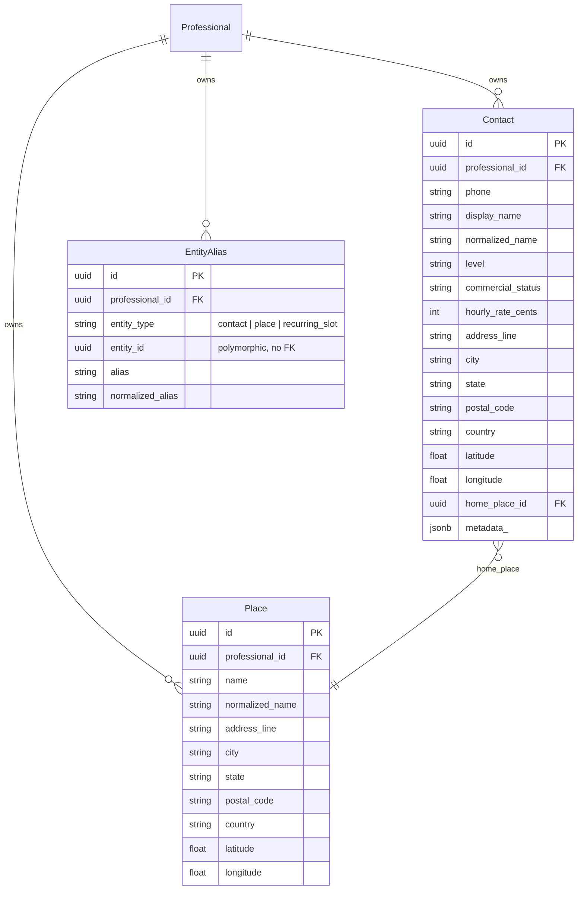
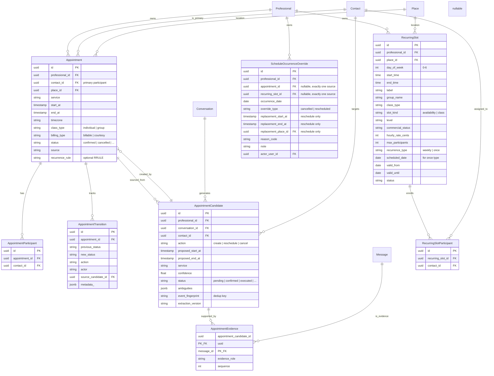
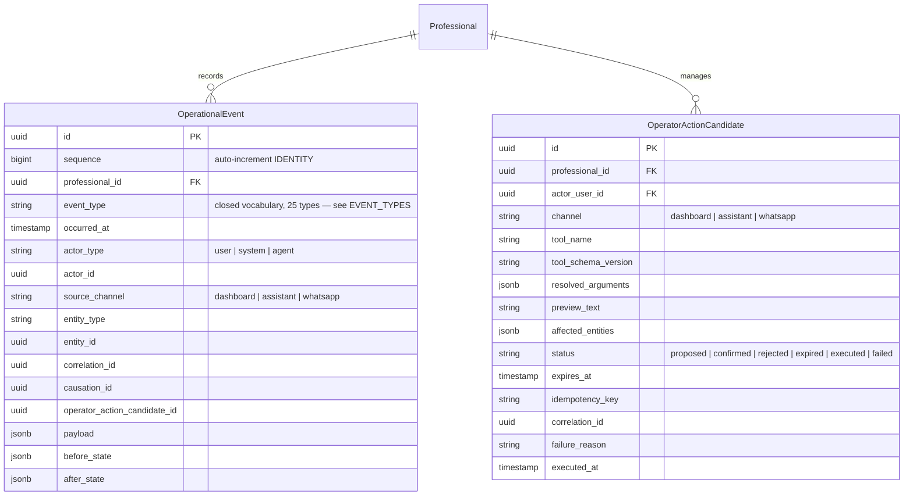
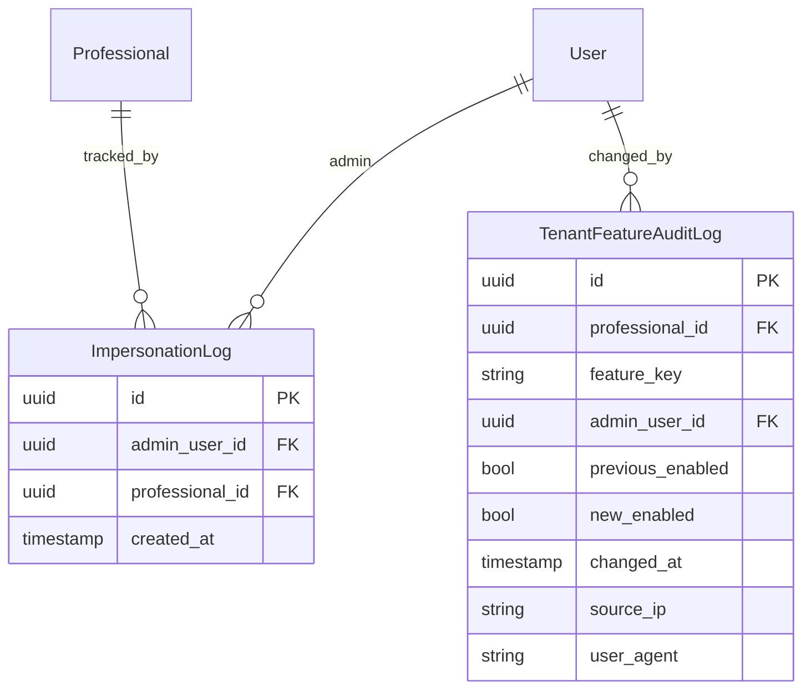

# Data Architecture

## 1. Database Overview

**Engine:** PostgreSQL running in Docker container `agenda_db`.
**ORM:** SQLAlchemy 2.0 with UUID primary keys.
**Migrations:** Alembic, stored in `backend/migrations/versions/`.

All models inherit from `Base` (declarative base) and are defined in
`backend/app/models/`. There are **33 models** organized by domain (count
drifts as features land — `ls backend/app/models/*.py` for the current
number).

---

## 2. Core Identity & Multi-Tenancy

```mermaid
erDiagram
  Professional ||--o{ User : employs
  Professional ||--o{ TenantFeature : has
  Professional ||--o{ AssistantSettings : configures

  Professional {
    uuid id PK
    string name
    string timezone
    string default_service
    int default_duration_minutes
    string assistant_phone
    time daily_summary_time
    string status
  }

  User {
    uuid id PK
    uuid professional_id FK "nullable (null = platform_admin)"
    string email
    string hashed_password
    string role "platform_admin | professional"
    string status
  }

  TenantFeature {
    uuid id PK
    uuid professional_id FK
    string feature_key "e.g. commercial_financials"
    bool enabled
    uuid configured_by_user_id FK
  }

  AssistantSettings {
    uuid professional_id PK_FK
    float temperature
    int memory_window_messages
    uuid updated_by_user_id FK
  }
```

`Professional` represents a **tenant**. `User` with `professional_id=NULL`
is a platform admin with cross-tenant access.

---

## 3. Contacts & Places (Customer Ontology)



`EntityAlias` enables the AI agent to resolve fuzzy names like
"Marizinha," "quadra 2," "sabado de manha" to the correct entity via
normalized alias matching.

---

## 4. Conversations & Messages

```mermaid
erDiagram
  Professional ||--o{ Conversation : owns
  Conversation ||--o{ Message : contains
  Contact ||--o{ Conversation : participates_in
  Conversation ||--o| PendingProcessing : has

  Conversation {
    uuid id PK
    uuid professional_id FK
    uuid contact_id FK
    timestamp last_message_at
    int processing_cursor
    string status "active | archived"
  }

  Message {
    uuid id PK
    uuid professional_id FK
    uuid conversation_id FK
    string provider_message_id UK
    string direction "inbound | outbound"
    string message_type "text | audio | image | document"
    text text
    text transcription
    timestamp sent_at
    jsonb raw_payload
    string processing_status "pending | processed | failed"
  }

  PendingProcessing {
    uuid id PK
    uuid conversation_id FK_UK
    timestamp process_after
  }
```

Messages arrive via WhatsApp webhook, are deduplicated by
`provider_message_id`, and flow through the chat pipeline.

---

## 5. Appointments & Scheduling



### Key Relationships

- `AppointmentCandidate` is the **AI detection artifact**: messages are
  analyzed, candidates are created, and confirmed candidates become
  `Appointment` rows.
- `AppointmentEvidence` links candidates to the messages that support them.
- `AppointmentTransition` is a per-appointment audit trail of status
  changes.
- `ScheduleOccurrenceOverride` cancels or reschedules a single occurrence
  of a recurring appointment or recurring slot without changing the
  template.

---

## 6. Makeup Class Credits

```mermaid
erDiagram
  Professional ||--o{ MakeupClassCredit : grants
  Contact ||--o{ MakeupClassCredit : receives
  Appointment ||--o{ MakeupClassCredit : redeemed_by
  RecurringSlot ||--o{ MakeupClassCredit : originated_from

  MakeupClassCredit {
    uuid id PK
    uuid professional_id FK
    uuid contact_id FK
    uuid origin_event_id FK "the OperationalEvent that granted this credit"
    uuid origin_recurring_slot_id FK
    date origin_occurrence_date
    string status "available | redeemed | expired | forfeited"
    timestamp granted_at
    date expires_at
    timestamp redeemed_at
    uuid redeemed_appointment_id FK
  }
```



Credits are granted only to **recurring group** students (`RecurringSlot`
participants — never one-off appointment students) either when the whole
group occurrence is cancelled, or when a single participant's absence is
noted without cancelling the class for the rest of the group, and only if
the notice given exceeds `ProfessionalFinancialSettings.
cancellation_notice_hours`. They can be redeemed when booking a make-up
class. `expires_at` and the `forfeited` status are reserved for a future
pass — nothing currently sets either one; a credit above
`MAX_OUTSTANDING_CREDITS` (10) is simply never granted, not forfeited.

---

## 7. Financial Module

```mermaid
erDiagram
  Professional ||--|| ProfessionalFinancialSettings : configures
  Professional ||--o{ FinancialRate : defines
  Professional ||--o{ PlaceFinancialRate : defines
  Professional ||--o{ RevenueOccurrence : records
  Professional ||--o{ PrimeTimeWindow : defines
  Professional ||--o{ WorkJourneyInterval : defines

  Place ||--o{ PlaceFinancialRate : priced_by

  RevenueOccurrence ||--o{ RevenueOccurrenceParticipant : has
  RevenueOccurrence ||--o{ RevenueOccurrenceLine : has
  RevenueOccurrenceParticipant ||--o{ RevenueOccurrenceLine : generates

  ProfessionalFinancialSettings {
    uuid professional_id PK_FK
    string default_commercial_status
    string currency
    bool prime_time_configured
    int cancellation_notice_hours
  }

  FinancialRate {
    uuid id PK
    uuid professional_id FK
    int participant_count "1-4"
    int hourly_rate_cents
  }

  PlaceFinancialRate {
    uuid id PK
    uuid professional_id FK
    uuid place_id FK
    string time_category "regular | prime"
    int participant_count "1-4"
    int hourly_rate_cents
  }

  PrimeTimeWindow {
    uuid id PK
    uuid professional_id FK
    jsonb days_of_week
    time start_time
    time end_time
  }

  WorkJourneyInterval {
    uuid id PK
    uuid professional_id FK
    int day_of_week "0-6"
    string interval_type "work | break"
    time start_time
    time end_time
  }

  RevenueOccurrence {
    uuid id PK
    uuid professional_id FK
    string source_type "appointment | recurring_slot"
    uuid source_id
    date occurrence_date
    timestamp starts_at
    timestamp ends_at
    string timezone
    string source_label_snapshot
    uuid place_id
    string place_name_snapshot
    string outcome_status "pending | confirmed"
    int participant_count
    int billable_participant_count
    string currency
    int quoted_total_cents
    int subtotal_cents
    int adjustment_cents
    int total_cents
  }

  RevenueOccurrenceParticipant {
    uuid id PK
    uuid occurrence_id FK
    uuid contact_id
    string contact_name_snapshot
    string attendance_status
    bool billable
    string non_billable_reason
    int quoted_amount_cents
    int billed_amount_cents
  }

  RevenueOccurrenceLine {
    uuid id PK
    uuid participant_snapshot_id FK
    string time_category "regular | prime"
    int start_minute
    int end_minute
    int duration_minutes
    string rate_source
    int hourly_rate_cents
    int quoted_amount_cents
    int billed_amount_cents
    bool prime_override_applied
  }
```

Revenue occurrences are **immutable snapshots**: once a date is confirmed,
its revenue records are frozen. The financial module also supports
"what-if" scenarios via `FinancialScenario`.

---

## 8. Operational Audit (Event Sourcing)



`OperationalEvent` is append-only. `OperatorActionCandidate` tracks the
lifecycle of AI-proposed mutations through propose → confirm → execute.

---

## 9. Platform Administration



---

## 10. Index Strategy

Key indexes (defined in model files, applied via Alembic):

- `professional_id` on every tenant-scoped table (primary query filter)
- `contact_id` on appointments, participants, makeup credits
- `place_id` on appointments, recurring slots, place rates
- `conversation_id` on messages, candidates
- `provider_message_id` UNIQUE on messages (dedup guard)
- `occurrence_date` on revenue occurrences and schedule overrides
- `status` columns on appointments, candidates, credits, revenue occurrences
- Composite unique: `(appointment_id, contact_id)` on participants
- Composite unique: `(recurring_slot_id, contact_id)` on slot participants
- Composite unique: `(appointment_candidate_id, message_id)` on evidence

---

## 11. Data Flow for Key Operations

### Create Appointment (Dashboard)

```
POST /api/appointments
  → calendar.py validates contact/place belong to the tenant, calls
    appointments.create_appointment()
    → assert_no_conflict(): validates against the work journey (fails open
      if the professional never configured one) + existing appointment/
      class overlap
    → INSERT INTO appointments (write)
    → INSERT INTO appointment_transitions (status history)
    → Return detail
```

No revenue row is created here — revenue recognition is a separate,
explicit, later step (see "Revenue Confirmation" below); it can't even
run until the occurrence has already ended.

### Cancel a Group Occurrence via the AI Agent (Web Chat)

```
Instructor (web chat, NOT WhatsApp — that channel isn't wired up for the
active agent yet): "cancela a aula de amanha da turma X"
  → app/api/assistant.py → agent/orchestrator.py's tool loop
  → tools.py: get_schedule() resolves the date + occurrence
  → mutations.py: propose_cancel_schedule()
    → candidates.propose() → INSERT operator_action_candidates (status=proposed)
    → agent replies with the deterministic preview text, e.g.
      "Cancelar Grupo em 15/08/2026 08:00 (Clube Harminia)."
  → Instructor clicks Confirm → POST /api/assistant/candidates/{id}/confirm
  → candidates.confirm() → mutations.py: _execute_cancel_schedule()
    → schedule_overrides.cancel_occurrence() → INSERT schedule_occurrence_overrides
    → record_event() → INSERT operational_events (schedule.occurrence.cancelled)
    → for a recurring_slot target: makeup_credits.grant_credit_if_eligible()
      runs once per enrolled participant → INSERT makeup_class_credits for
      each one eligible (this cancels the WHOLE occurrence for everyone —
      see propose_note_participant_absence for the single-participant case)
```

### Revenue Confirmation

```
POST /api/financial/revenue/occurrences
  body: {source_type, source_id, occurrence_date, participant_outcomes, ...}
  → revenue_occurrences.create_revenue_occurrence()
    → Rejects if this (source_type, source_id, occurrence_date) was already
      confirmed, or if the occurrence hasn't ended yet
    → Resolves pricing per participant/segment via financial_capacity
    → INSERT revenue_occurrences + revenue_occurrence_participants +
      revenue_occurrence_lines
    → Return the frozen detail — once inserted, these rows are immutable
```
