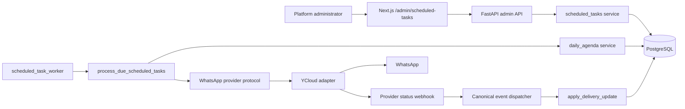
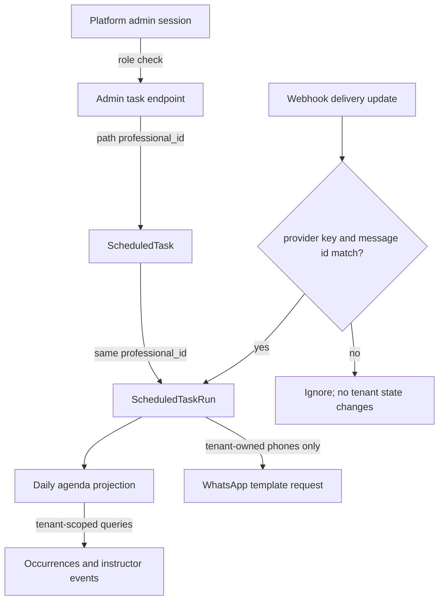
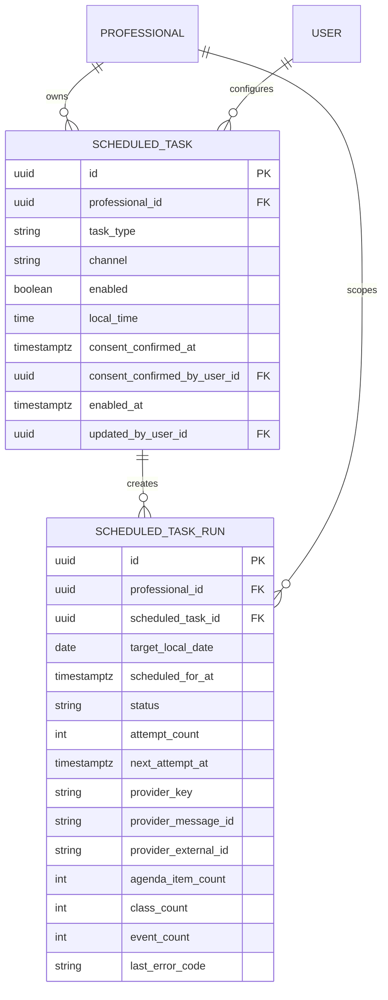
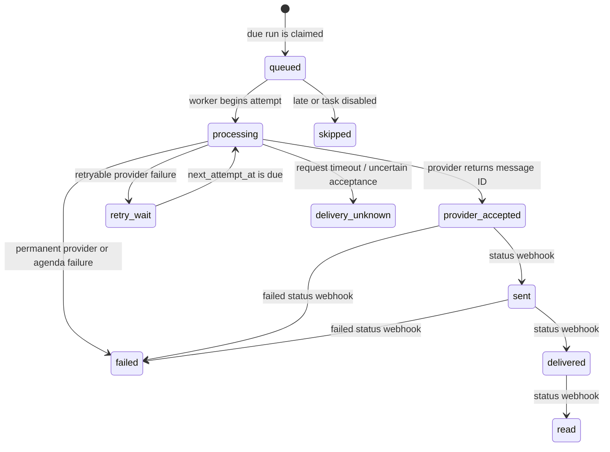
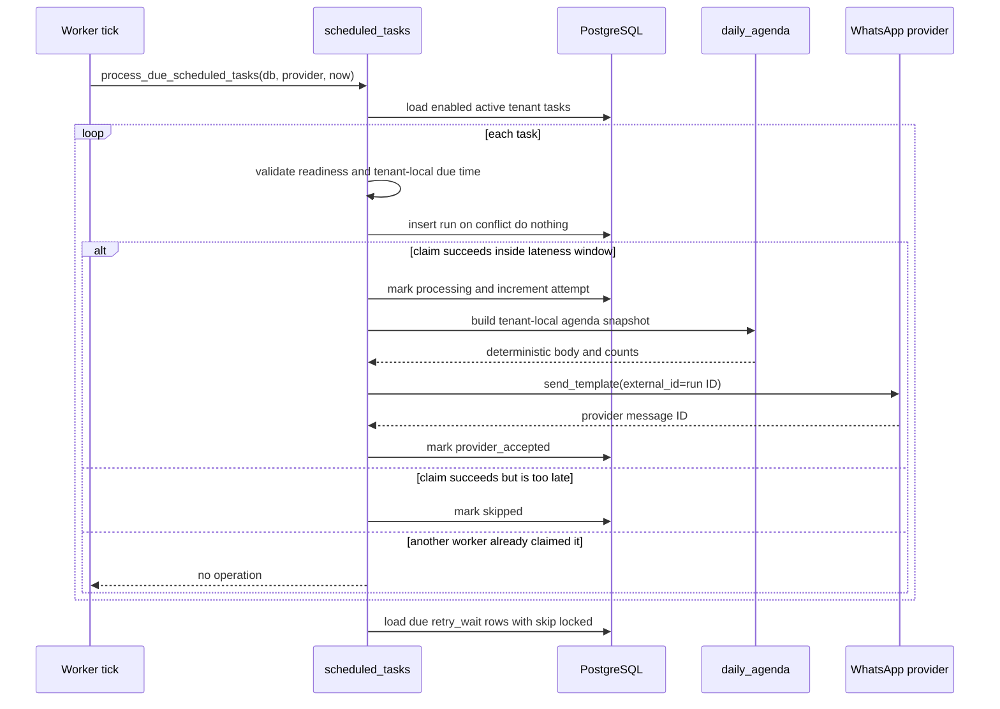
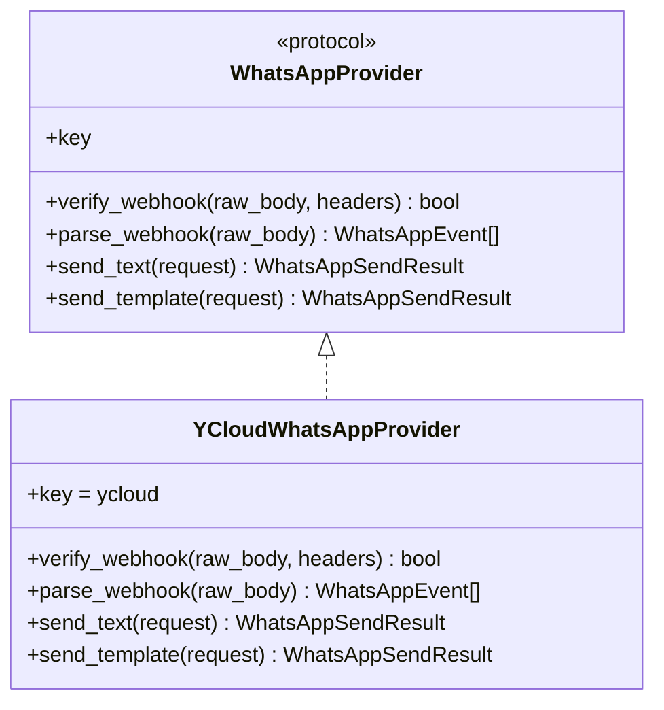
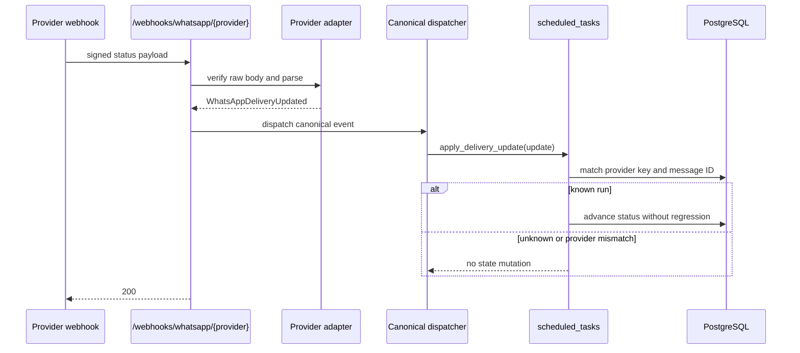

# Scheduled Tasks Architecture

**Status:** Implemented locally

This document describes the first scheduled-task capability: a platform
administrator configures a tenant-local morning WhatsApp agenda, and a durable
worker sends it to that tenant's instructor. It documents the code that is in
the repository, rather than the earlier planning alternatives in the
[scheduled-tasks roadmap](ROADMAPS/scheduled_tasks_daily_agenda_roadmap_v0.1_2026-08-16.md).

## 1. Responsibilities and boundaries

The current task type is `daily_agenda_summary`. It runs at most once per
tenant-local calendar day and sends a deterministic pt-BR agenda containing
that tenant's schedule occurrences and confirmed instructor events.

The system deliberately separates four concerns:

- **Configuration:** platform-admin APIs persist the tenant's enabled state,
  local time, and consent acknowledgement.
- **Agenda projection:** `daily_agenda` reads the tenant's schedule and events
  for a requested local date and formats the message.
- **Durable execution:** `scheduled_tasks` claims one run, records attempts and
  outcomes, and decides retry behavior.
- **WhatsApp transport:** a provider-neutral contract isolates the application
  from YCloud-specific webhook, HTTP, and template payload details.



The polling loop in `app/chat/scheduled_task_worker.py` is intentionally thin.
All scheduling decisions and database mutations live in
`app/services/scheduled_tasks.py`, so a future managed scheduler can invoke
the same service without reimplementing delivery logic.

## 2. Tenant isolation and authorization

`Professional` is the tenant boundary. Neither the browser nor the worker may
choose a tenant from arbitrary request data:

- The three admin endpoints require `require_platform_admin`.
- The configured task always stores `professional_id`; it is never inferred
  from the target phone number.
- The run stores both `professional_id` and `scheduled_task_id`. This makes
  history filtering and operational inspection tenant-scoped even if task
  configuration later changes.
- Agenda reads take `professional_id` explicitly and scope every schedule/event
  query to it.
- A run sends only from that professional's `agent_phone` to that
  professional's `assistant_phone`.
- Incoming provider messages are namespaced by `provider_key` and
  `provider_message_id`; delivery updates match the same provider identity
  before they can modify a run.



The task is not eligible to execute when the tenant is inactive, its timezone
is invalid, or either required WhatsApp number is missing. Enabling also
requires the platform administrator to record instructor consent. Configuration
changes create a `scheduled_task.configuration.updated` entry in the
tenant-scoped operational event ledger.

## 3. Components and source map

| Concern | Primary implementation |
|---|---|
| Admin panel | `frontend/src/app/admin/scheduled-tasks/page.tsx` |
| Admin API | `backend/app/api/admin.py` |
| Request/response schema | `backend/app/schemas/api.py` |
| Task configuration and execution | `backend/app/services/scheduled_tasks.py` |
| Agenda read model and formatter | `backend/app/services/daily_agenda.py` |
| Polling process | `backend/app/chat/scheduled_task_worker.py` |
| Task/run persistence | `backend/app/models/scheduled_task.py`, `scheduled_task_run.py` |
| Provider contracts and registry | `backend/app/integrations/whatsapp/` |
| YCloud adapter | `backend/app/integrations/whatsapp/ycloud.py` |
| Webhook dispatch and reconciliation | `backend/app/api/whatsapp.py`, `backend/app/chat/ingestion.py` |
| Schema migration | `backend/migrations/versions/c4e7f9a1b2d3_scheduled_tasks_and_whatsapp_provider.py` |

## 4. Persistent model and delivery state

The migration adds `provider_key` to `messages` and replaces the former global
message identifier constraint with `(provider_key, provider_message_id)`. That
preserves deduplication during a future provider migration.

It also adds two task-specific tables.



`ScheduledTask` is a configuration row, not an execution record. The database
enforces one row per `(professional_id, task_type)`. Its first and only current
type is `daily_agenda_summary`; its channel is `whatsapp`.

`ScheduledTaskRun` is the delivery ledger. Its unique constraint on
`(scheduled_task_id, target_local_date)` is the core once-per-local-day
guarantee. PostgreSQL `INSERT ... ON CONFLICT DO NOTHING` claims that key, so
repeated polling ticks or concurrent workers cannot create a second intent for
the same task/date. Indexes support due-retry lookup, tenant history, and
provider status reconciliation.

The valid states are:



`delivery_unknown` is deliberately terminal for automatic delivery. A timeout
may have reached the provider; retrying automatically could send a duplicate
proactive message. The recorded run and its external ID make investigation
possible without silently resending.

## 5. Service-level contract

### 5.1 `daily_agenda` read model

`app.services.daily_agenda` is read-only. Its public responsibilities are:

| Function | Contract |
|---|---|
| `get_professional_timezone(professional)` | Validates and returns the tenant IANA timezone. Invalid configuration fails safely. |
| `list_daily_agenda_items(db, professional_id, target_date)` | Loads the tenant, projects schedule occurrences for its local day, includes reschedules whose replacement moved into that day, loads confirmed instructor events overlapping that day, and returns chronological items. |
| `format_daily_agenda(target_date, items)` | Deterministically renders the pt-BR body used both by the scheduled task and the existing instructor `hoje` command. |

The service treats the tenant's local-midnight boundaries as authoritative. It
uses the schedule service's `include_rescheduled_replacements=True` option so a
class moved from another date still appears on the date where it will actually
occur. It includes only confirmed instructor events, then sorts events and
classes by local start time. It never includes notes, income, phone numbers,
or internal IDs in the rendered message.

### 5.2 Configuration service

`update_daily_agenda_task(...)` is the sole write path for the current task
configuration. It is called only by the platform-admin API and it:

1. Loads the target `Professional` by the path-derived tenant ID.
2. Validates tenant readiness when enablement is requested.
3. Requires explicit consent when enablement is requested.
4. Creates or updates the single task row.
5. Records who confirmed consent and who last updated the configuration.
6. Sets `enabled_at` when an enabled schedule/time changes, preventing a
   same-day retroactive send.
7. Appends a configuration audit event with before/after state and request
   source metadata.

`next_run_at(task, professional, now_utc)` is a pure display calculation. It
converts the current UTC instant to tenant-local time, selects the next local
configured instant, and returns it in UTC. It does not persist derived state.

### 5.3 Execution service

`process_due_scheduled_tasks(db, provider, now_utc=None)` is the worker entry
point. It receives an adapter through the provider-neutral protocol, making
delivery policy testable without a real provider. It loads enabled tasks for
active tenants, claims due runs, and then processes retryable runs whose
`next_attempt_at` is due.



The internal units are intentionally small:

| Unit | Responsibility |
|---|---|
| `task_readiness` | Returns deterministic tenant-level blockers: inactive tenant, missing sender/recipient phone, or invalid timezone. |
| `_claim_due_run` | Converts the tick to local time, rejects early/late/retroactive tasks, then atomically creates exactly one run. |
| `_deliver_run` | Captures the agenda snapshot, increments attempt state, calls `send_template`, and records provider acceptance or a classified failure. |
| `_mark_retry_or_failed` | Applies bounded exponential backoff for definitely retryable provider errors. |
| `apply_delivery_update` | Reconciles asynchronous provider status without regressing an already more advanced delivery state. |

Failure classification is part of the service contract:

| Condition | Durable outcome |
|---|---|
| Worker arrives after `SCHEDULED_TASK_MAX_LATENESS_MINUTES` | `skipped`, with `missed_delivery_window` |
| Provider definitely rejects / missing template configuration | `failed` |
| Agenda or tenant configuration error during send | `failed` |
| Network failure or provider 5xx | `retry_wait`, then bounded retry; `failed` after `SCHEDULED_TASK_MAX_ATTEMPTS` |
| Timeout or unreadable accepted response | `delivery_unknown`, with no automatic duplicate retry |
| Provider status `sent`, `delivered`, or `read` | State advances only forward |
| Provider status `failed` before delivery/read | `failed`, with provider error context |

## 6. Provider-neutral WhatsApp boundary

Application services depend on `WhatsAppProvider`, not on YCloud payloads. The
contract covers webhook signature verification and parsing, free-form text
delivery, template delivery, and canonical response/error types.



The registry resolves the deployment-wide `WHATSAPP_PROVIDER` setting at the
API and worker composition roots. Current selected value: `ycloud`. The
adapter owns YCloud HMAC handling, JSON shape, API headers, logical template
mapping, and translation to canonical errors. `daily_agenda`,
`scheduled_tasks`, agent-channel, and passive-escalation business logic do not
inspect YCloud JSON or call YCloud HTTP directly.

The scheduled sender asks for the logical template key `daily_agenda` and sets
`external_id` to `scheduled-task-run:<run UUID>`. The adapter maps that key to
`YCLOUD_DAILY_AGENDA_TEMPLATE_NAME`. The template must be approved and named
in the environment before a production tenant is enabled.

## 7. Webhook reconciliation

The adapter parses inbound messages, outbound echoes, and delivery updates into
canonical event types. The dispatcher routes delivery updates to the task
service before customer-message ingestion. An update is harmless when it does
not match a known run or belongs to another provider.



The generic endpoint is `POST /webhooks/whatsapp/{provider_key}`. The existing
`POST /webhooks/ycloud` endpoint remains a compatibility alias for an already
registered YCloud callback. Outside `DEBUG=true`, invalid signatures receive
`401`; malformed verified payloads receive `400`.

## 8. Admin API and panel behavior

| Endpoint | Role | Purpose |
|---|---|---|
| `GET /api/admin/scheduled-tasks` | platform admin | Returns a paginated, server-filtered page of configured daily-agenda tasks, including readiness, masked phones, next run, and latest run. |
| `PUT /api/admin/tenants/{professional_id}/scheduled-tasks/daily-agenda` | platform admin | Upserts enabled state, local time, and consent acknowledgement. |
| `GET /api/admin/tenants/{professional_id}/scheduled-tasks/daily-agenda/runs` | platform admin | Returns bounded, tenant-scoped run history. |
| `GET /api/admin/scheduled-task-tenants` | platform admin | Returns bounded tenant suggestions for the creation combobox. |
| `GET /api/admin/scheduled-task-runs` | platform admin | Returns paginated, filterable global execution-log rows without agenda body or provider payload. |

The Next.js panel presents the same information per tenant. It applies an
optimistic state update for enable/disable and configuration saves, then
replaces it with the server response. A rejected update restores the prior
state and shows an error. The backend remains the authority for consent and
readiness validation.

The platform-admin tenant tile keeps its secondary controls in a
**Configurações** dialog. Its tabs expose the existing assistant and financial
module settings plus a read-only **Resumo de tarefas**. `GET /api/admin/tenants`
includes this compact task summary (configuration state, readiness, next run,
and latest run) without agenda content or provider payloads. Changes continue
through the dedicated task-manager panel, preserving its tenant-scoped audit
and validation path.

## 9. Configuration and runtime operation

The relevant environment parameters are externalized in `.env`:

| Parameter | Purpose |
|---|---|
| `WHATSAPP_PROVIDER` | Deployment-wide provider selection; currently `ycloud`. |
| `SCHEDULED_TASK_POLL_SECONDS` | Poll interval for the thin worker process. |
| `SCHEDULED_TASK_MAX_LATENESS_MINUTES` | Latest permitted delivery after the tenant-local due instant. |
| `SCHEDULED_TASK_MAX_ATTEMPTS` | Maximum attempts for definitely retryable delivery failures. |
| `SCHEDULED_TASK_RETRY_BASE_SECONDS` | Base delay for exponential retry backoff. |
| `YCLOUD_DAILY_AGENDA_TEMPLATE_NAME` | Approved YCloud template mapped from logical key `daily_agenda`. |
| `YCLOUD_DAILY_AGENDA_TEMPLATE_LANGUAGE` | Template language code, normally `pt_BR`. |
| `YCLOUD_DAILY_AGENDA_TTL_SECONDS` | Optional provider template time-to-live. |

Local startup is:

```bash
conda activate agenda
alembic -c backend/alembic.ini upgrade head
python start_server.py --worker
```

`--worker` starts the candidate worker, passive-escalation worker, and the
scheduled-task worker. Production deployments should run the same scheduled
worker as a continuously available process with access to the shared database;
it must not be a request-only, scale-to-zero process.

## 10. Operational invariants and observability

- A run has one and only one tenant, task, and target local date.
- The agenda snapshot is created at attempt time. Later schedule edits do not
  mutate the historical rendered body or trigger a second daily send.
- A task enabled at or after today's due instant does not backfill today's
  message; the next local day is eligible.
- Unknown provider responses are visible as `delivery_unknown` rather than
  retried blindly.
- Provider delivery events cannot regress `delivered` or `read` to an earlier
  state.
- Run history persists counts, rendered body, timestamps, provider identifiers,
  and sanitized failure details for diagnosis.
- Configuration edits are appended to `operational_events` with the acting
  platform administrator and request source metadata.

Recommended production alerts are: failed or delivery-unknown runs, an
unexpectedly old latest successful run for an enabled tenant, a stopped worker,
and sustained retry backlog. Logs must not include provider secrets, raw
credentials, or unnecessary customer PII.

## 11. Test coverage

Focused tests live alongside the implementation:

| Test module | Behavior covered |
|---|---|
| `backend/tests/test_daily_agenda.py` | Deterministic formatting of class and instructor-event items. |
| `backend/tests/test_scheduled_tasks.py` | Tenant-scoped once-only send, delivery-state reconciliation, consent validation, and configuration audit event. |
| `backend/tests/test_whatsapp_provider.py` | YCloud signature verification, canonical parsing, and invalid payload rejection. |

Existing agent-channel and calendar tests additionally protect the shared
`hoje` formatter and legacy occurrence-detail behavior. The migration is
`c4e7f9a1b2d3` and should be applied before exercising the feature against any
database.
