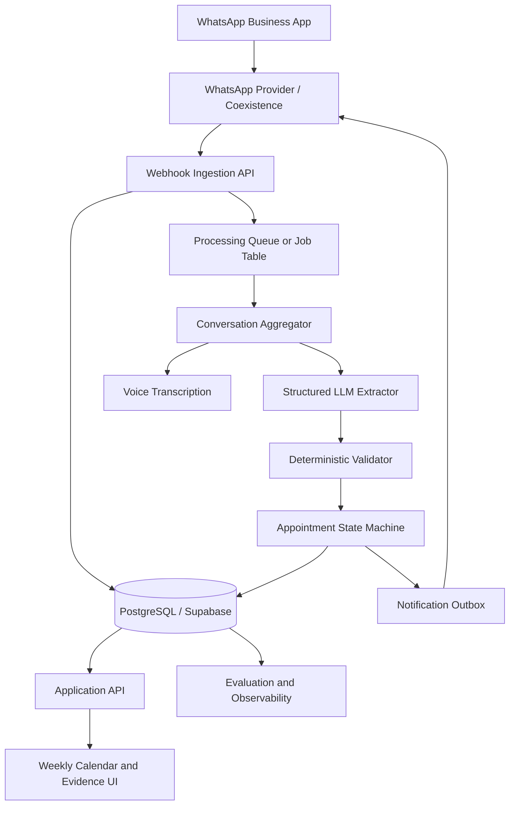
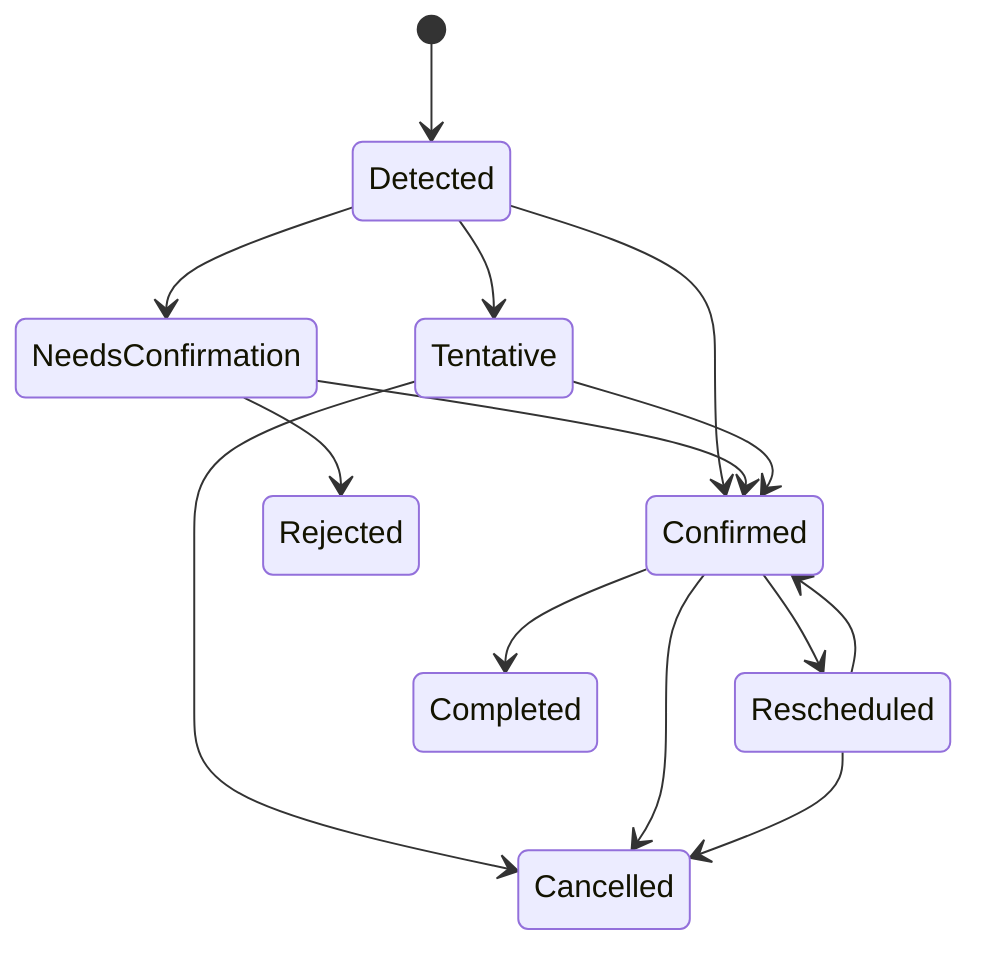
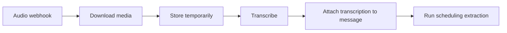

# WhatsApp Schedule Copilot — Proof of Concept

**Status:** Project brief  
**Version:** 0.3  
**Initial vertical:** Independent tennis instructors  
**Primary interface:** WhatsApp Business  
**Secondary interface:** Lightweight web calendar  
**Code language:** English  
**Conversation and UI language:** pt-BR (Brazilian Portuguese)  
**Target market:** Brazil  

---

## 1. Project Summary

The WhatsApp Schedule Copilot is a lightweight AI product for independent professionals who organize most of their work through WhatsApp conversations.

The initial use case is a tennis instructor who talks directly with students through the WhatsApp Business app. During those conversations, the instructor and the student agree on lessons, cancellations, rescheduling, recurring sessions, and other schedule-related details.

The product passively receives the conversation events exposed by the WhatsApp Business Platform, identifies scheduling decisions, converts them into structured appointments, and keeps an invisible calendar for the instructor.

The instructor does not need to change how they communicate with students. They can continue using the WhatsApp Business mobile application normally.

The product then:

1. detects possible appointments, cancellations, and rescheduling events;
2. stores the structured schedule in a database;
3. sends summaries and confirmation requests to the instructor through a separate assistant conversation;
4. provides a simple weekly calendar on the web;
5. preserves the messages used as evidence for every inferred appointment.

The Proof of Concept should validate whether a useful and sufficiently reliable schedule can be reconstructed from real WhatsApp conversations with minimal effort from the professional.

---

## 2. Initial Use Case

### 2.1 User

João is an independent tennis instructor.

He teaches approximately 25 students and manages nearly all communication through WhatsApp Business. Students frequently ask questions such as:

- “Da pra aula amanha?”
- “Consegue mover a quinta pra 17h?”
- “Nao vou conseguir ir hoje.”
- “Bora manter toda terca as 18h.”
- “Minha filha pode usar minha vaga essa semana?”
- “Se chover, da pra passar pra sexta?”

João currently keeps part of his schedule in his head, part in WhatsApp, and part in a calendar application that he updates inconsistently.

### 2.2 Example conversation

```text
Aluna:
Da pra fazer aula amanha?

Professor:
Consigo as 17h.

Aluna:
Perfeito, confirmado.
```

The product should infer:

```yaml
action: create
customer_name: Mariana
start_at: 2026-08-02T17:00:00-03:00
duration_minutes: 60
service: tennis_lesson
status: confirmed
confidence: 0.96
```

The event is stored together with the WhatsApp message identifiers used as evidence.

### 2.3 Instructor notification

The private assistant sends João a message:

```text
Nova aula detectada

Mariana
Domingo, 2 de agosto
17:00–18:00

Evidencia:
Mariana: “Da pra fazer aula amanha?”
Voce: “Consigo as 17h.”
Mariana: “Perfeito, confirmado.”

[Confirmar] [Corrigir] [Abrir conversa]
```

For the Proof of Concept, the “Open conversation” action may open the correct WhatsApp conversation through a `wa.me` link. It should not promise navigation to an exact source message, because WhatsApp does not expose a public message permalink for this use case.

---

## 3. Problem Statement

Independent professionals often run their businesses through conversational tools rather than formal operational software.

Their schedule is distributed across:

- text messages;
- voice messages;
- message replies;
- informal confirmations;
- cancellations;
- recurring arrangements;
- implicit references such as “the usual time”;
- conversations with many different customers.

Traditional scheduling software requires explicit data entry or requires customers to use booking pages. Both approaches introduce behavior change.

The product hypothesis is:

> A passive assistant that turns existing WhatsApp conversations into a reliable schedule can create value without requiring the professional or the customer to adopt a new workflow.

---

## 4. Product Thesis

The first product is not a general AI assistant and not a complete scheduling platform.

It is a narrow operational layer that:

- observes permitted WhatsApp Business conversation events;
- identifies schedule-changing decisions;
- converts them into structured records;
- asks for human confirmation when necessary;
- preserves evidence;
- presents the resulting schedule in WhatsApp and on a simple web calendar.

The product should behave more like an event-processing system with an LLM-based semantic parser than like an autonomous multi-agent system.

### Core principle

```text
Conversation
    ↓
Structured scheduling event
    ↓
Deterministic validation
    ↓
Human confirmation when needed
    ↓
Appointment state update
```

---

## 5. Proof of Concept Objectives

The PoC should answer five questions.

### 5.1 Detection

Can the system identify real scheduling decisions from natural WhatsApp conversations?

### 5.2 Temporal interpretation

Can it correctly resolve expressions such as:

- tomorrow;
- next Friday;
- o horario de sempre;
- depois do almoco;
- as cinco;
- a semana que vem;
- mover a aula de hoje pra quinta?

### 5.3 State tracking

Can it distinguish among:

- a proposal;
- a tentative arrangement;
- a confirmed appointment;
- a rescheduling;
- a cancellation;
- a recurring schedule;
- a conversation that contains no appointment?

### 5.4 Trust

Does showing source evidence make the instructor comfortable with the inferred calendar?

### 5.5 Behavior change

Can the instructor receive value while continuing to use WhatsApp Business normally?

---

## 6. PoC Scope

### 6.1 Included

The first PoC should support:

- one tennis instructor;
- one connected WhatsApp Business number;
- text messages;
- optionally, voice-message transcription;
- inbound messages from students;
- outbound-message echoes sent by the instructor through the app;
- appointment creation;
- appointment confirmation;
- appointment rescheduling;
- appointment cancellation;
- a configurable default lesson duration;
- a daily WhatsApp summary;
- a weekly web calendar;
- an appointment evidence page;
- manual correction;
- audit logs;
- basic evaluation metrics.

### 6.2 Explicitly excluded

The first PoC should not include:

- automated customer service;
- an AI agent that negotiates directly with students;
- payments;
- invoicing;
- package and credit management;
- court booking;
- public booking pages;
- complex availability optimization;
- team scheduling;
- marketplace features;
- mobile applications;
- vector databases;
- RAG;
- graph databases;
- multi-agent orchestration;
- a general-purpose CRM;
- full Google Calendar synchronization;
- automatic creation of recurring appointments without confirmation.

---

## 7. Product Experience

## 7.1 Onboarding

For the pilot, onboarding can be assisted.

1. Create an instructor account.
2. Configure:
   - instructor name;
   - timezone;
   - default lesson duration;
   - assistant notification number;
   - optional working hours.
3. Connect the instructor’s WhatsApp Business number through the provider’s Coexistence flow.
4. Verify receipt of:
   - inbound customer messages;
   - messages sent by the instructor from the WhatsApp Business app.
5. Send a test message.
6. Mark the connection as active only after both directions are verified.

A later product version may embed the Meta Embedded Signup flow inside the application.

## 7.2 Normal operation

The instructor continues using WhatsApp Business normally.

The system processes the conversation in the background and creates appointment candidates.

Depending on confidence and risk, the system either:

- records the event and informs the instructor;
- asks for confirmation;
- asks for correction;
- stores the conversation without creating an appointment.

## 7.3 Daily summary

At a configurable time, the assistant sends:

```text
Sua agenda de domingo

09:00 — Carlos
11:00 — Renata
17:00 — Mariana
19:00 — Pedro

1 aula precisa de confirmacao.
```

The instructor may also ask:

```text
O que eu tenho amanha?
```

For the initial PoC, this can be implemented with a small set of deterministic commands rather than an unrestricted conversational agent.

## 7.4 Web calendar

The instructor can open a responsive web application and inspect the week.

The interface should show:

- confirmed appointments;
- AI-detected appointments awaiting confirmation;
- cancelled appointments;
- customer name;
- start and end times;
- confidence state;
- appointment origin;
- evidence link.

---

## 8. High-Level Architecture



---

## 9. Recommended PoC Stack

| Layer | Recommended option |
|---|---|
| WhatsApp integration | YCloud Coexistence or equivalent official provider |
| Backend | FastAPI |
| Validation and schemas | Pydantic |
| ORM | SQLAlchemy |
| Migrations | Alembic |
| Database | PostgreSQL, optionally managed through Supabase |
| Authentication | Supabase Auth or a minimal magic-link provider |
| File storage | Supabase Storage or S3-compatible storage |
| Frontend | Next.js with React |
| UI components | shadcn/ui |
| Calendar | FullCalendar |
| Structured LLM output | Instructor or native structured outputs |
| Date parsing | dateparser plus custom rules |
| Recurrence | `dateutil.rrule` |
| Voice transcription | Hosted speech-to-text API for the PoC |
| Background jobs | Database-backed job table or Redis + Celery |
| LLM observability | Langfuse |
| Application errors | Sentry |
| Deployment | Vercel for frontend; Azure Web App or Container Apps for backend |

### Architecture guidance

Keep the provider integration behind an internal interface:

```python
class MessagingProvider(Protocol):
    async def send_text(self, to: str, text: str) -> str: ...
    async def send_interactive(self, to: str, payload: dict) -> str: ...
    async def download_media(self, media_id: str) -> bytes: ...
    async def verify_webhook(self, request: Request) -> bool: ...
```

This reduces coupling to YCloud and makes a future provider migration easier.

### Open-source accelerators

No open-source project solves this pipeline end-to-end. Passive extraction from a professional's existing 1:1 conversation — as opposed to an active WhatsApp booking chatbot that talks to the customer — is not an available off-the-shelf category; the reviewed OSS WhatsApp/scheduling tools (Baileys-based bots, Chatwoot-style inboxes) all assume an agent or bot replying to the customer, which is explicitly out of scope here (Section 4). The following libraries reduce effort on specific parts of the pipeline instead:

- **[Instructor](https://github.com/instructor-ai/instructor)** — structured LLM output with Pydantic schema enforcement, automatic retries, and validation. Use instead of building custom prompt-to-schema parsing.
- **[pydantic-ai](https://github.com/pydantic/pydantic-ai)** — alternative structured-output library from the Pydantic team. Evaluate alongside Instructor for extraction tasks.
- **[dateparser](https://github.com/scrapinghub/dateparser)** — handles relative and absolute date expressions in multiple languages including pt-BR ("amanha as 5", "proxima sexta"). Combine with custom rules for Brazilian Portuguese colloquialisms.
- **[Langfuse](https://github.com/langfuse/langfuse)** — open-source LLM observability. Self-hostable. Tracks prompt versions, token costs, extraction quality, and latency over time.
- **[Lucia](https://github.com/lucia-auth/lucia)** — lightweight alternative to Supabase Auth if minimal magic-link authentication is sufficient for the PoC.
- **[Presidio](https://github.com/microsoft/presidio)** — open-source PII detection/redaction, useful for the log-redaction requirement in Section 22. pt-BR entity recognition is weaker than English and will need custom rules for Brazilian names and phone formats.

### WhatsApp integration caveat

**[Baileys](https://github.com/WhiskeySockets/Baileys)** is a popular open-source WhatsApp Web API, but it is unofficial and carries account-ban risk. For the PoC, stick with YCloud Coexistence or the official Meta Cloud API. Baileys may be useful only for rapid offline prototyping of message parsing.

### Provider cost economics

Coexistence billing works in this product's favor: messages sent from the WhatsApp Business App itself (both directions — student and instructor) are not billed by Meta. Only messages sent through the API are billed, which in this architecture is limited to the assistant's own notifications to the instructor (a handful of utility-category messages per day). The instructor-student conversation the product actually reads carries no Meta messaging cost, regardless of provider.

Given that, provider choice is mostly about the BSP's own platform fee, not Meta's per-message rate. YCloud fits this segment better than 360dialog: YCloud has a $0/month tier with pay-as-you-go message costs and no setup fee, while 360dialog charges a flat minimum of roughly €49/month per connected number regardless of volume. For a low-income, low-volume professional — and especially for a future multi-tenant model with many low-ARPU professionals — a fixed per-number monthly floor erodes unit economics fast. Verify current numbers directly against each provider's pricing page before committing; this space recently shifted from conversation-based to per-message billing and rates are still moving.

### Background jobs

Skip Celery and Redis for the PoC. A PostgreSQL-backed job table with `FOR UPDATE SKIP LOCKED` is sufficient for one instructor and avoids infrastructure complexity. Graduate to Celery only if concurrency requirements grow.

### Localization

The target market is Brazil and all user-facing content (WhatsApp messages, assistant notifications, web calendar labels, evidence pages) must be in pt-BR. Key considerations:

- **LLM extraction prompt**: instruct the model that all conversation input is in pt-BR and that the output schema fields remain in English, but the `explanation` field should be in pt-BR.
- **Date parsing**: configure `dateparser` for `pt-BR` locale. Handle Brazilian Portuguese colloquialisms: "amanha" (tomorrow), "depois de amanha" (day after tomorrow), "semana que vem" (next week), "as 5" (at 5, typically PM for lessons), "horario de sempre" (usual time).
- **Time conventions**: in Brazil, "as 5" in the context of a tennis lesson almost always means 17:00. The system should apply this as a configurable domain default rather than leaving it ambiguous.
- **Date format**: dd/mm/yyyy (Brazilian standard), not mm/dd/yyyy.
- **WhatsApp assistant**: all notification templates must be in pt-BR.
- **Web calendar UI**: labels, buttons, status names, and date/time formatting in pt-BR.
- **Voice transcription**: select a speech-to-text provider with strong pt-BR support (e.g., Google Cloud Speech-to-Text, Azure Speech, or AssemblyAI).

---

## 10. Core Domain Model

## 10.1 Professional

Represents the instructor.

```yaml
id: uuid
name: string
timezone: America/Sao_Paulo
default_service: tennis_lesson
default_duration_minutes: 60
assistant_phone: string
daily_summary_time: "07:00"
status: active
```

## 10.2 Contact

Represents a student or customer.

```yaml
id: uuid
professional_id: uuid
provider_contact_id: string
phone: string
display_name: string
normalized_name: string
metadata: json
```

## 10.3 Conversation

Represents the relationship between a professional and one customer.

```yaml
id: uuid
professional_id: uuid
contact_id: uuid
last_message_at: datetime
processing_cursor: datetime
status: active
```

## 10.4 Message

Stores normalized message events.

```yaml
id: uuid
professional_id: uuid
conversation_id: uuid
provider_message_id: string
direction: inbound | outbound
message_type: text | audio | image | document | system
text: string | null
transcription: string | null
quoted_provider_message_id: string | null
sent_at: datetime
received_at: datetime
raw_payload: json
processing_status: pending | processed | failed
```

`provider_message_id` must have a unique constraint to guarantee webhook idempotency.

## 10.5 Appointment candidate

Represents an AI interpretation that has not necessarily become a confirmed appointment.

```yaml
id: uuid
professional_id: uuid
conversation_id: uuid
contact_id: uuid
action: create | confirm | reschedule | cancel | recurrence | none
proposed_start_at: datetime | null
proposed_end_at: datetime | null
service: string | null
confidence: float
status: detected | needs_confirmation | accepted | rejected | superseded
ambiguities: json
extraction_version: string
created_at: datetime
```

## 10.6 Appointment

Represents the operational calendar record.

```yaml
id: uuid
professional_id: uuid
contact_id: uuid
service: string
start_at: datetime
end_at: datetime
timezone: string
status: tentative | confirmed | cancelled | completed
source: ai_detected | manually_created | imported
recurrence_rule: string | null
created_at: datetime
updated_at: datetime
```

## 10.7 Appointment evidence

Connects an appointment or candidate to source messages.

```yaml
appointment_candidate_id: uuid
message_id: uuid
evidence_role: proposal | time | confirmation | cancellation | context
sequence: integer
```

## 10.8 Appointment transition

Stores every state change.

```yaml
id: uuid
appointment_id: uuid
previous_status: string | null
new_status: string
action: create | confirm | reschedule | cancel | correct
actor: system | instructor | administrator
source_candidate_id: uuid | null
created_at: datetime
metadata: json
```

---

## 11. Appointment State Machine

The appointment lifecycle should be explicit and deterministic.



### Important rule

The LLM proposes a domain action. It does not directly mutate the final appointment record.

The application layer must validate and apply the proposed transition.

For example:

```text
LLM output:
action = reschedule
original_appointment_reference = "Thursday lesson"
new_start_at = Friday 17:00

Application logic:
1. find a plausible existing appointment;
2. verify the customer;
3. verify temporal consistency;
4. reject if multiple appointments match;
5. create a rescheduling candidate;
6. request confirmation when ambiguity remains.
```

---

## 12. Message Processing Pipeline

## 12.1 Webhook ingestion

The webhook endpoint should:

1. verify the provider signature;
2. persist the raw event;
3. normalize the event;
4. enforce idempotency;
5. acknowledge the webhook quickly;
6. schedule asynchronous processing.

Do not call the LLM synchronously before returning the webhook response.

## 12.2 Conversation buffering

Scheduling decisions often span multiple messages.

Example:

```text
Aluna: Da pra sexta?
Professor: De tarde.
Aluna: As cinco?
Professor: Pode ser.
```

The system should process a window containing:

- the new message;
- recent messages from the same conversation;
- unresolved appointment candidates;
- upcoming appointments for the contact;
- professional defaults.

A simple debounce window may be useful. For example:

- receive message;
- wait 20–60 seconds for follow-up messages;
- process the conversation window;
- reprocess immediately if a strong confirmation or cancellation phrase arrives.

The exact debounce period should be configurable.

#### Recommended implementation

Use a database-level scheduled job rather than in-memory timers for reliability across restarts:

```text
message arrives → insert into pending_processing with process_after = now() + 30s
worker polls WHERE process_after <= now()
  → re-aggregates the conversation window
  → runs extraction

if new message arrives before the window closes:
  → bump process_after forward (reset the debounce timer)
```

This pattern survives application restarts, works with horizontal scaling, and requires no external message broker for the PoC.

## 12.3 Normalized conversation input

```json
{
  "professional": {
    "timezone": "America/Sao_Paulo",
    "default_duration_minutes": 60,
    "service": "tennis_lesson"
  },
  "contact": {
    "display_name": "Mariana"
  },
  "current_time": "2026-08-01T15:20:00-03:00",
  "upcoming_appointments": [],
  "messages": [
    {
      "id": "msg_101",
      "direction": "inbound",
      "sent_at": "2026-08-01T15:18:00-03:00",
      "text": "Da pra fazer aula amanha?"
    },
    {
      "id": "msg_102",
      "direction": "outbound",
      "sent_at": "2026-08-01T15:19:00-03:00",
      "text": "Consigo as 17h."
    },
    {
      "id": "msg_103",
      "direction": "inbound",
      "sent_at": "2026-08-01T15:20:00-03:00",
      "text": "Perfeito, confirmado."
    }
  ]
}
```

---

## 13. LLM Extraction Contract

The LLM should return a strict structured object.

```python
from datetime import datetime
from typing import Literal
from pydantic import BaseModel, Field


class Ambiguity(BaseModel):
    field: Literal[
        "date",
        "time",
        "duration",
        "customer",
        "service",
        "appointment_reference",
        "confirmation_status",
    ]
    description: str


class SchedulingEvent(BaseModel):
    action: Literal[
        "create",
        "confirm",
        "reschedule",
        "cancel",
        "recurrence",
        "none",
    ]

    customer_name: str | None = None
    start_at: datetime | None = None
    end_at: datetime | None = None
    duration_minutes: int | None = None
    service: str | None = None

    existing_appointment_id: str | None = None
    recurrence_rule: str | None = None

    confidence: float = Field(ge=0.0, le=1.0)
    evidence_message_ids: list[str] = []
    ambiguities: list[Ambiguity] = []
    explanation: str
```

### Prompt responsibilities

The extraction prompt should instruct the model to:

- all input messages are in pt-BR (Brazilian Portuguese);
- infer only scheduling-related actions;
- distinguish proposals from confirmations;
- resolve relative dates using each message timestamp;
- use the professional timezone;
- avoid inventing missing information;
- return `none` when no operational scheduling event exists;
- cite only message identifiers present in the input;
- identify unresolved ambiguities;
- avoid creating recurring events unless recurrence is explicit;
- prefer uncertainty over a confident false positive.

### Prompt non-responsibilities

The model should not:

- send messages;
- write directly to the database;
- mutate appointments;
- select arbitrary tools;
- negotiate with the customer;
- decide retention policy;
- generate SQL;
- create external calendar events.

### Extraction implementation

Use **[Instructor](https://github.com/instructor-ai/instructor)** or **[pydantic-ai](https://github.com/pydantic/pydantic-ai)** to enforce the `SchedulingEvent` schema directly from the LLM response. These libraries handle retries on validation failure, schema enforcement, and structured output parsing — eliminating the need for custom JSON extraction logic.

For temporal fields, combine LLM output with deterministic validation:

1. LLM returns a proposed `start_at` (or `null` if ambiguous);
2. application validates the datetime against the professional timezone;
3. application cross-checks with `dateparser` using the original message text and `pt-BR` locale;
4. if LLM and deterministic parser disagree significantly, flag as an ambiguity.

---

## 14. Temporal Resolution

Temporal interpretation is one of the highest-risk parts of the product.

The application should combine:

1. LLM semantic interpretation;
2. deterministic date parsing;
3. professional timezone;
4. message timestamps;
5. upcoming appointment context;
6. domain defaults.

### Example

Message sent on Saturday, August 1, 2026:

```text
“Amanha as cinco pode?”
```

Expected result:

```text
2026-08-02T17:00:00-03:00
```

### Ambiguous time

```text
“Consegue as cinco?”
```

Depending on local conventions, five may mean 5 PM for a tennis lesson, but the system should only apply such a default if explicitly configured or supported by context.

Otherwise:

```yaml
action: create
start_at: null
confidence: 0.55
ambiguities:
  - field: time
    description: "A conversa nao distingue 5h da manha das 17h."
```

### Relative appointment references

```text
“Mover a aula de quinta pra sexta.”
```

The application should retrieve the customer’s relevant Thursday appointment and provide it to the LLM as context.

The LLM should not search the database independently.

---

## 15. Confidence and Automation Policy

The PoC should use a conservative policy.

| Confidence and conditions | Action |
|---|---|
| High confidence, explicit confirmation, no conflict | Create confirmed appointment and notify instructor |
| Medium confidence or minor ambiguity | Create candidate and request confirmation |
| Low confidence | Store extraction result but do not create appointment |
| Potential collision | Request confirmation |
| Recurrence detected | Always request confirmation |
| Cancellation detected for a unique appointment | Mark as pending cancellation or request confirmation |
| Multiple matching appointments | Request clarification |

Suggested initial thresholds:

```yaml
high_confidence: 0.90
medium_confidence: 0.70
low_confidence: below 0.70
```

Thresholds must be calibrated using real conversations rather than treated as permanent product rules.

### Calibration caveat

The `confidence` field is the model's self-reported estimate, not a measured probability. LLM self-reported confidence is commonly miscalibrated — models often report 0.90+ on outputs that are correct closer to 70% of the time. Before trusting the thresholds above, plot predicted confidence against actual correctness on the labeled dataset (Section 24) and adjust the thresholds to match observed accuracy, rather than assuming the raw score is meaningful on an absolute scale. This calibration check should be a Phase 0 exit criterion (Section 27), not a post-launch refinement.

---

## 16. Evidence and Auditability

Every AI-generated appointment should be explainable.

The evidence view should display:

- customer name;
- interpreted date and time;
- status;
- confidence;
- source messages;
- message direction;
- timestamps;
- extraction version;
- changes made by the instructor;
- appointment transition history.

### Evidence page example

```text
Mariana — Aula de tenis

Domingo, 2 de agosto
17:00–18:00
Status: Confirmada
Detectada automaticamente
Confianca: 96%

Evidencia da conversa

15:18 — Mariana
“Da pra fazer aula amanha?”

15:19 — Voce
“Consigo as 17h.”

15:20 — Mariana
“Perfeito, confirmado.”

[Corrigir aula]
[Cancelar aula]
[Abrir conversa do WhatsApp]
```

### WhatsApp deep link

Use a link such as:

```text
https://wa.me/<customer_phone>
```

This opens the original customer conversation when supported by the device.

Do not represent it as a permalink to a specific message.

---

## 17. WhatsApp Assistant Channel

The assistant should communicate privately with the professional through a number controlled by the product.

This avoids trying to send assistant messages from the professional’s own monitored number to themselves.

### Initial message types

The PoC needs only a small set.

#### New appointment detected

```text
Nova aula detectada

Mariana
Domingo as 17h

[Confirmar] [Corrigir] [Abrir conversa]
```

#### Rescheduling detected

```text
Possivel reagendamento

Mariana
De quinta as 16h
Para sexta as 17h

[Confirmar alteracao] [Revisar]
```

#### Cancellation detected

```text
Possivel cancelamento

Carlos
Hoje as 19h

[Confirmar cancelamento] [Manter aula]
```

#### Daily summary

```text
Aulas de hoje

09:00 — Carlos
11:00 — Renata
17:00 — Mariana
19:00 — Pedro
```

### Command scope

The PoC may support:

```text
hoje
amanha
esta semana
proxima aula
```

These should map to deterministic queries.

A general conversational assistant is outside the first scope.

---

## 18. Web Application

## 18.1 Pages

```text
/login
/agenda
/appointments/:id
/settings
```

An optional internal administrator page may be added:

```text
/admin/evaluations
```

## 18.2 Weekly calendar

Use FullCalendar with a weekly time-grid view.

Required behavior:

- show one week at a time;
- click an appointment to open its details;
- visually distinguish statuses;
- support mobile layout;
- allow manual appointment correction;
- optionally allow manual appointment creation;
- show a badge for AI-detected events;
- show a warning for unresolved candidates.

## 18.3 Appointment detail

Display:

- student;
- date;
- start and end times;
- status;
- confidence;
- source;
- evidence;
- audit trail;
- correction action;
- WhatsApp conversation link.

## 18.4 Settings

Initial settings:

- professional name;
- timezone;
- default lesson duration;
- daily summary time;
- working hours;
- assistant destination number;
- WhatsApp connection status;
- data-retention preference.

---

## 19. API Surface

A minimal application API could include:

```text
POST   /webhooks/ycloud
GET    /health

GET    /api/me
GET    /api/calendar?start=&end=
GET    /api/appointments/{id}
POST   /api/appointments
PATCH  /api/appointments/{id}
POST   /api/appointments/{id}/confirm
POST   /api/appointments/{id}/cancel

GET    /api/candidates
GET    /api/candidates/{id}
POST   /api/candidates/{id}/accept
POST   /api/candidates/{id}/reject
POST   /api/candidates/{id}/correct

GET    /api/conversations/{id}/messages
GET    /api/settings
PATCH  /api/settings
```

Internal worker functions:

```text
process_message_event
transcribe_audio
build_conversation_window
extract_scheduling_event
validate_scheduling_event
apply_appointment_transition
send_instructor_notification
send_daily_summary
```

---

## 20. Background Jobs and Reliability

The system must assume that:

- webhook events may be duplicated;
- webhook events may arrive out of order;
- provider API calls may fail;
- LLM calls may time out;
- media URLs may expire;
- the same conversation may be processed more than once.

### Required patterns

#### Idempotency

Unique provider message IDs.

#### Outbox

Store outgoing messages before sending them.

```yaml
id: uuid
professional_id: uuid
destination: string
message_type: string
payload: json
status: pending | sent | failed | dead_letter
attempt_count: integer
next_attempt_at: datetime
provider_message_id: string | null
```

#### Retry

Use exponential backoff.

#### Dead-letter state

After a configurable number of failures, preserve the job for inspection.

#### Processing lock

Prevent simultaneous processing of the same conversation.

For the first user, these mechanisms can be implemented with PostgreSQL tables rather than a complex distributed messaging system.

---

## 21. Audio Messages

Voice messages are common in the target market and should be supported early, but not necessarily in the first development milestone.

### pt-BR transcription note

Select a speech-to-text provider with strong pt-BR support. Evaluate accuracy on informal Brazilian Portuguese, including contractions ("pra", "pro", "ta"), slang ("beleza", "blz", "valeu"), and background noise common in outdoor sports environments. Google Cloud Speech-to-Text and Azure Speech both offer pt-BR models; benchmark both before committing.

Pipeline:



Store:

- original provider media identifier;
- MIME type;
- transcription;
- transcription model;
- transcription timestamp;
- optional confidence metadata.

The original audio should be deleted according to a short retention policy unless it is required for evaluation and the instructor has explicitly agreed.

---

## 22. Privacy and Security

This PoC processes personal conversations and must be designed conservatively.

### Minimum controls

- explicit onboarding and authorization by the professional;
- official WhatsApp Business Platform integration;
- tenant isolation;
- encrypted secrets;
- HTTPS;
- webhook signature validation;
- least-privilege credentials;
- restricted administrative access;
- audit logs;
- configurable retention;
- deletion workflow;
- no use of conversation data to train a general model;
- no unnecessary storage of raw media;
- no exposure of one customer’s messages to another customer;
- redaction of message content in standard application logs.

### Data minimization

Prefer keeping:

- normalized appointment records;
- minimal contact identifiers;
- only the message fragments required as evidence.

Consider deleting unrelated raw conversation content after a short retention window.

### PoC consent

For the first real pilot, obtain written acknowledgment from the instructor describing:

- which conversations are processed;
- what the product extracts;
- where data is stored;
- how long data is retained;
- how the integration can be disconnected.

Legal and LGPD review should occur before broader rollout.

### LGPD compliance (Brazil)

Since the target market is Brazil, the Lei Geral de Protecao de Dados (LGPD) applies from the first pilot. This is not a deferred concern.

- **Legal basis**: obtain explicit consent from the instructor (data controller for their students' messages). Legitimate interest may apply for the instructor's own data, but not for third-party conversation content.
- **Consent chain is not yet settled**: whether the instructor's own consent is sufficient authorization to process their students' message content, or whether a separate legal basis reachable without requiring each student to interact with a system they never signed up for is required, is an open legal question. Treat this as the central item for legal review, not a formality resolved by the instructor signing a DPA.
- **Data Processing Agreement**: the pilot instructor must sign a DPA acknowledging that student message content is processed by the product.
- **Right to deletion**: implement a deletion workflow from Phase 1, not as a later feature. Both the instructor and individual students (through the instructor) must be able to request data removal.
- **Data residency**: evaluate whether Supabase/Azure regions support Brazilian data residency requirements, or use a Brazilian cloud provider.
- **Privacy policy**: required before the first real conversation is processed, even in pilot mode.
- **ANPD awareness**: monitor ANPD guidance on automated decision-making and profiling, as the LLM extraction constitutes automated processing of personal data.

LGPD review should occur **before Phase 1 (message ingestion)**, not after the PoC. The pilot cannot legally begin without it.

---

## 23. Observability and Evaluation

The PoC is an experiment, so evaluation must be part of the product.

### Store for each extraction

- model;
- prompt version;
- structured input;
- structured output;
- latency;
- token usage;
- estimated cost;
- confidence;
- validation result;
- instructor decision;
- instructor correction;
- final appointment state.

### Core metrics

#### Precision

Of all appointments created or suggested, how many represented real appointments?

#### Recall

Of all real appointments agreed in the sampled conversations, how many did the product detect?

#### Exact temporal accuracy

How often were date and start time fully correct?

#### No-edit confirmation rate

Percentage of candidates the instructor confirms without modification.

This should be the primary product metric.

#### False-positive rate

Percentage of non-scheduling conversations interpreted as appointments.

#### Rescheduling accuracy

Percentage of rescheduling events correctly linked to an existing appointment.

#### Cancellation accuracy

Percentage of cancellations correctly detected and applied.

#### Confirmation burden

Average number of manual actions required per appointment.

#### Processing latency

Time between the last relevant message and assistant notification.

### Suggested PoC targets

These are initial experiment targets, not production guarantees.

```yaml
appointment_precision: ">= 90%"
exact_date_time_accuracy: ">= 85%"
no_edit_confirmation_rate: ">= 80%"
false_positive_rate: "<= 5%"
median_detection_latency: "< 2 minutes"
```

Recall may initially be lower if the system is intentionally conservative.

---

## 24. Test Dataset

Before activating the live assistant, build a small manually labeled dataset.

Suggested minimum:

- 50 positive scheduling conversations;
- 30 conversations with proposals but no confirmation;
- 20 cancellations;
- 20 rescheduling cases;
- 10 recurring schedule cases;
- 30 non-scheduling conversations;
- text and voice-message examples in pt-BR;
- ambiguous temporal expressions;
- Brazilian Portuguese colloquialisms and abbreviations (e.g., "q" for "que", "vc" for "voce", "tb" for "tambem", "blz" for "beleza", "pdo" for "pode");
- multiple appointments with the same customer.

Each example should contain:

```yaml
messages: [...]
expected_action: create | confirm | reschedule | cancel | recurrence | none
expected_start_at: datetime | null
expected_existing_appointment: id | null
expected_evidence_message_ids: [...]
notes: string
```

Use this dataset as a regression suite for every prompt or model change.

---

## 25. Critical Test Scenarios

### Basic creation

```text
Aluna: Amanha as 5?
Professor: Pode, confirmado.
```

### Proposal without confirmation

```text
Aluna: Talvez sexta as 4?
Professor: Vou verificar.
```

Esperado: nenhuma aula confirmada.

### Implicit confirmation

```text
Professor: Consigo terca as 18h.
Aluna: Otimo.
```

### Rescheduling

```text
Aluna: Da pra mover a aula de amanha pra sexta?
Professor: Sexta as 17h serve.
```

### Cancellation

```text
Aluna: Nao vou conseguir ir hoje. Vamos cancelar.
```

### Ambiguous time

```text
Aluna: Consegue as cinco?
```

### “Usual time”

```text
Aluna: Mesmo horario semana que vem?
Professor: Sim.
```

Requires historical appointment context.

### Recurrence

```text
Aluna: Bora manter toda terca as 18h.
Professor: Fechado.
```

Esperado: solicitar confirmacao antes de criar recorrencia.

### Multiple appointments

```text
Aluna: Manter terca, mas cancelar quinta.
```

### No appointment

```text
Aluna: A raquete chegou. Obrigada.
Professor: Show.
```

Expected: `none`.

---

## 26. Suggested Repository Structure

```text
whatsapp-schedule-copilot/
├── README.md
├── docs/
│   ├── project-brief.md
│   ├── data-model.md
│   ├── prompt-contract.md
│   └── evaluation-plan.md
│
├── backend/
│   ├── pyproject.toml
│   ├── alembic.ini
│   ├── migrations/
│   ├── app/
│   │   ├── main.py
│   │   ├── api/
│   │   │   ├── webhooks.py
│   │   │   ├── appointments.py
│   │   │   ├── candidates.py
│   │   │   └── settings.py
│   │   ├── domain/
│   │   │   ├── appointments.py
│   │   │   ├── conversations.py
│   │   │   ├── evidence.py
│   │   │   └── transitions.py
│   │   ├── models/
│   │   ├── schemas/
│   │   ├── repositories/
│   │   ├── services/
│   │   │   ├── messaging_provider.py
│   │   │   ├── ycloud.py
│   │   │   ├── extraction.py
│   │   │   ├── temporal.py
│   │   │   ├── transcription.py
│   │   │   └── notifications.py
│   │   ├── workers/
│   │   │   ├── process_conversation.py
│   │   │   ├── send_outbox.py
│   │   │   └── daily_summary.py
│   │   └── observability/
│   └── tests/
│       ├── fixtures/
│       ├── test_extraction.py
│       ├── test_transitions.py
│       └── test_webhooks.py
│
├── frontend/
│   ├── package.json
│   ├── app/
│   │   ├── agenda/
│   │   ├── appointments/[id]/
│   │   └── settings/
│   ├── components/
│   │   ├── calendar/
│   │   ├── appointment-detail/
│   │   └── evidence/
│   └── lib/
│
└── infra/
    ├── docker-compose.yml
    ├── backend.Dockerfile
    └── deployment/
```

---

## 27. Implementation Plan

### Day 0 — Provider capability spike

Before investing in Phase 0, confirm in the chosen provider's sandbox that both inbound customer messages and outbound instructor messages sent from the WhatsApp Business App arrive via webhook. This is a binary go/no-go dependency for the entire passive-assistant thesis (see Open Question 16): without instructor-sent echoes, most state-tracking logic (implicit confirmations, corrections, cancellations) cannot function. The check takes a few hours, requires no labeled data or prompts, and should happen first.

## Phase 0 — Offline extraction prototype

Goal: validate the semantic problem before connecting WhatsApp.

Build:

- Pydantic extraction schema;
- prompt (all examples and instructions in pt-BR);
- labeled conversation fixtures in pt-BR;
- standalone extraction CLI (input: pasted conversation, output: structured `SchedulingEvent` JSON);
- temporal validator using `dateparser` with pt-BR locale;
- regression tests against the labeled dataset.

Exit criterion:

- acceptable precision on a manually labeled pt-BR dataset;
- the extraction CLI correctly handles Brazilian Portuguese temporal expressions and colloquialisms;
- confidence scores are checked against actual accuracy on the labeled dataset and the thresholds in Section 15 are adjusted accordingly.

## Phase 1 — Message ingestion

Prerequisite: LGPD consent framework and privacy policy must be in place before processing real conversations.

Build:

- YCloud webhook endpoint;
- signature verification;
- normalized message storage;
- inbound and outbound-echo handling;
- idempotency;
- basic conversation view for developers.

Exit criterion:

- reconstruct both sides of a real instructor–student conversation.

## Phase 2 — Appointment candidate pipeline

Build:

- conversation buffering;
- LLM extraction;
- deterministic validation;
- candidate storage;
- evidence storage;
- manual inspection page.

Exit criterion:

- detect real appointment candidates without notifying the instructor.

Run this phase in shadow mode first.

## Phase 3 — Instructor feedback loop

Build:

- private assistant notifications;
- confirm;
- reject;
- correct;
- outbox and retries;
- correction logging.

Exit criterion:

- instructor can validate every candidate without using the web interface.

## Phase 4 — Weekly calendar

Build:

- authentication;
- FullCalendar weekly view;
- appointment detail;
- evidence page;
- manual correction;
- open-WhatsApp link.

Exit criterion:

- instructor can inspect and correct the complete weekly schedule.

## Phase 5 — Daily operation

Build:

- daily summary;
- deterministic “today/tomorrow/this week” queries;
- cancellation and rescheduling logic;
- basic metrics dashboard.

Exit criterion:

- one instructor can use the system for at least two weeks.

## Phase 6 — Voice messages

Build:

- media download;
- transcription;
- retention cleanup;
- extraction from transcripts.

Exit criterion:

- audio-based scheduling decisions are included in the evaluation dataset and calendar.

---

## 28. MVP Acceptance Criteria

The PoC is ready for a real pilot when:

- WhatsApp Business Coexistence is connected;
- inbound and instructor-sent messages are received;
- duplicated webhooks do not create duplicated records;
- conversations are reconstructed in order;
- scheduling events are returned through a strict schema;
- candidates contain message evidence;
- the instructor can confirm, reject, or correct a candidate;
- confirmed appointments appear on a weekly calendar;
- cancellations and rescheduling actions preserve an audit trail;
- daily summaries can be sent;
- application errors and LLM traces are observable;
- data can be deleted for the pilot user;
- the product can run in shadow mode.

---

## 29. Pilot Plan

### Participant

One tennis instructor who already uses WhatsApp Business and agrees to test the product.

### Duration

Two to four weeks.

### Week 1

Shadow mode:

- receive messages;
- extract candidates;
- do not send automatic confirmations;
- manually compare candidates with the instructor’s real schedule.

### Week 2

Assisted mode:

- send candidates to the instructor;
- request confirmation;
- record corrections;
- provide weekly calendar access.

### Weeks 3–4

Operational mode:

- high-confidence appointments may be added automatically;
- medium-confidence events still require confirmation;
- daily summaries are enabled;
- rescheduling and cancellation detection are evaluated.

### Weekly interview questions

- Which detected appointments were useful?
- Which mistakes reduced trust?
- Did the assistant create extra work?
- Did the instructor check the web calendar?
- Was WhatsApp alone sufficient?
- Were evidence excerpts useful?
- Which scheduling situations were not understood?
- Would the instructor pay for the product?
- What monthly price would feel reasonable?
- Which next feature would be most valuable?

---

## 30. Success Criteria for the Product Hypothesis

The project should continue beyond the PoC if most of the following are true:

- the instructor uses the system for at least two consecutive weeks;
- most appointments are confirmed without correction;
- false positives remain rare;
- the instructor reports fewer forgotten or manually transcribed appointments;
- the evidence model creates trust;
- the instructor continues using WhatsApp normally;
- the weekly calendar is useful even if accessed infrequently;
- the operational cost supports a viable subscription price;
- the same extraction model appears transferable to another independent professional.

The project should be reconsidered if:

- WhatsApp onboarding is too difficult for the target user;
- the instructor frequently negotiates schedules in groups that are not accessible;
- temporal ambiguity creates too many confirmation requests;
- the provider cost per connected customer is too high;
- the instructor does not value a reconstructed calendar;
- the Meta native product fully solves the same workflow for the target segment.

---

## 31. Future Product Directions

Only after validating the passive schedule should the product expand.

### Tennis-specific operations

- recurring lesson packages;
- consumed lesson credits;
- rain-related rescheduling;
- court allocation;
- substitute instructor;
- student inactivity alerts;
- vacant-slot suggestions;
- expected weekly revenue;
- payment reminders;
- no-show tracking.

### Other professional verticals

- personal trainers;
- beauty professionals;
- home-service providers;
- contractors and construction supervisors;
- tutors;
- therapists, subject to stricter privacy requirements;
- photographers;
- music teachers.

### Platform capabilities

- self-service WhatsApp onboarding;
- Google Calendar synchronization;
- multi-professional businesses;
- configurable domain ontologies;
- customer confirmation messages;
- availability-aware scheduling;
- billing;
- provider abstraction;
- prompt and model routing;
- evaluation dashboard;
- vertical templates.

---

## 32. Open Questions

1. Can the selected YCloud plan support the required Coexistence webhooks for the pilot?
2. Will the professional accept using WhatsApp Business instead of personal WhatsApp?
3. Will assistant notifications be sent from a shared product number or a dedicated number?
4. How much message history is available during onboarding?
5. What is the appropriate message-retention period?
6. Should high-confidence events be created automatically or always confirmed during the pilot?
7. How often does the instructor use voice messages to schedule lessons?
8. How often are lessons recurring?
9. Are lessons negotiated in individual conversations or groups?
10. Does the instructor already use another calendar?
11. Which phrases represent confirmation in the instructor’s normal communication style?
12. What is the minimum acceptable accuracy for the instructor to trust the product?
13. What is the total provider cost per connected professional?
14. Which Meta and provider approvals are required for embedded self-service onboarding?
15. Which parts of the data may be retained for model evaluation with explicit consent?
16. Does the selected WhatsApp provider deliver instructor-sent message echoes through webhooks? (Verify this in the Day 0 spike, before Phase 0 — see Section 27. Some provider tiers do not support outbound echoes.)
17. What is the per-extraction LLM cost at the expected message volume? (Track from day one to validate unit economics.)
18. How accurate is voice transcription for informal pt-BR in outdoor/sports environments?

---

## 33. Immediate Development Backlog

### Foundation

- [ ] Create repository and environments.
- [ ] Configure PostgreSQL or Supabase.
- [ ] Add migrations.
- [ ] Implement professional, contact, conversation, and message tables.
- [ ] Implement provider abstraction.
- [ ] Configure secrets and environment variables.
- [ ] Configure `dateparser` for pt-BR locale.
- [ ] Obtain LGPD legal review and create consent flow.
- [ ] Create pt-BR notification message templates.

### WhatsApp

- [ ] Create YCloud pilot account.
- [ ] Connect the instructor’s WhatsApp Business number.
- [ ] Configure webhook endpoint.
- [ ] Handle inbound text messages.
- [ ] Handle instructor message echoes.
- [ ] Store raw payloads safely.
- [ ] Add webhook idempotency.
- [ ] Verify both conversation directions.

### Extraction

- [ ] Define `SchedulingEvent` schema.
- [ ] Create initial extraction prompt.
- [ ] Build labeled fixture dataset (pt-BR conversations).
- [ ] Add temporal validation.
- [ ] Add appointment conflict checks.
- [ ] Add candidate and evidence storage.
- [ ] Add prompt versioning.
- [ ] Add Langfuse tracing.
- [ ] Build standalone extraction CLI for rapid testing.
- [ ] Evaluate Instructor vs pydantic-ai for structured extraction.

### Appointment logic

- [ ] Implement appointment state machine.
- [ ] Implement create transition.
- [ ] Implement confirmation transition.
- [ ] Implement rescheduling transition.
- [ ] Implement cancellation transition.
- [ ] Store transition history.
- [ ] Add manual correction.

### Instructor interaction

- [ ] Configure assistant destination number.
- [ ] Create new-candidate notification.
- [ ] Create confirmation action.
- [ ] Create rejection action.
- [ ] Create correction flow.
- [ ] Create open-conversation link.
- [ ] Implement outbox and retries.
- [ ] Implement daily summary.

### Web interface

- [ ] Add authentication.
- [ ] Create weekly FullCalendar view.
- [ ] Create appointment detail page.
- [ ] Create evidence component.
- [ ] Create settings page.
- [ ] Add responsive mobile layout.

### Evaluation

- [ ] Add extraction result table.
- [ ] Record instructor feedback.
- [ ] Calculate no-edit confirmation rate.
- [ ] Calculate false-positive rate.
- [ ] Calculate exact date/time accuracy.
- [ ] Benchmark speech-to-text accuracy for pt-BR voice messages.
- [ ] Review failures weekly.

---

## 34. Final Design Principles

1. **Preserve the user’s existing behavior.**  
   The professional should continue using WhatsApp normally.

2. **Be conservative.**  
   Missing an ambiguous appointment is initially less damaging than inventing one.

3. **Keep evidence attached.**  
   Every AI action must be traceable to source messages.

4. **Separate interpretation from execution.**  
   The LLM proposes; deterministic application code applies state changes.

5. **Prefer a simple state machine over autonomous agents.**

6. **Measure corrections as product data.**  
   Every correction is both a UX event and an evaluation label.

7. **Keep the web application secondary.**  
   WhatsApp is the primary interface; the calendar is an inspection and correction surface.

8. **Avoid premature platform complexity.**  
   No RAG, graph database, vector store, or multi-agent framework is needed for the initial PoC.

9. **Design provider boundaries early.**  
   WhatsApp infrastructure providers may change as pricing and scale requirements evolve.

10. **Validate the narrow workflow before expanding vertically.**

11. **Design for pt-BR from day one.**  
    All user-facing text, LLM prompts, date parsing, voice transcription, and notification templates must handle Brazilian Portuguese natively. This is not a localization layer to add later — it is a core product requirement for the target market.

---

## 35. One-Sentence Product Definition

> A passive WhatsApp Business copilot that converts conversations between independent professionals and their customers into an auditable, automatically maintained schedule.
