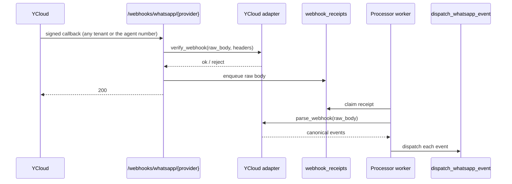
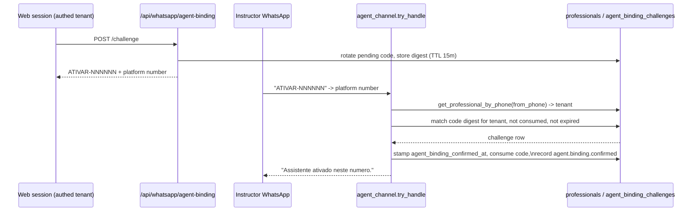

# WhatsApp: YCloud → Platform Flow

A code-first map of how a WhatsApp message becomes platform state, and of where
the "AI agent" identity is actually defined.

Written against the code as of 2026-09-06, after the
[Shared platform AI agent number roadmap](ROADMAPS/shared_platform_agent_number_roadmap_v0.1_2026-09-06.md)
(Phases A–J): one shared agent number for every tenant, sender-keyed tenant
resolution, and a binding second factor.

## 1. What YCloud knows, and what it does not

This is the single most common source of confusion, so it comes first.

**YCloud has no concept of "the AI agent."** It holds a set of phone numbers
registered to one WhatsApp Business Account and posts events for *all* of them
to *one* URL. There is no per-number webhook, no per-tenant endpoint, and no
setting anywhere in YCloud that marks one number as the assistant.

| Lives in YCloud | Lives in the platform |
| --- | --- |
| The WABA and its registered numbers | Which number belongs to which tenant |
| Coexistence pairing with the instructor's phone | The one shared agent number (`PLATFORM_AGENT_WHATSAPP_NUMBER`, env) |
| Message templates (approved, by name) | Which logical template maps to which name |
| One API key, one webhook signing secret | Everything about routing, tenancy, and identity |

Two consequences worth internalizing:

- **Tenancy is a database lookup, not provider configuration.** A message to
  the agent number is attributed to a tenant because that tenant's
  `assistant_phone` sent it — nothing in the payload names the tenant.
- **One shared account means one shared event stream.** Every tenant's traffic
  and the agent's own traffic arrive through the same endpoint, verified by the
  same secret, and must be told apart by the platform. §4 is where that
  happens; §7's guard is what keeps agent-channel traffic out of the observer
  lane.

### Coexistence, and why it matters

The platform runs on **YCloud Coexistence**
(`whatsapp_schedule_copilot_poc_project_brief_v0.1.md` §261, §327, §350). A
tenant's number is not API-only: it stays live in the instructor's WhatsApp
Business *app* on their phone, and YCloud mirrors the traffic to the platform.

That is why two different event types matter:

- `whatsapp.inbound_message.received` — a student messages the instructor.
- `whatsapp.smb.message.echoes` — the instructor replies **from the app**;
  YCloud echoes it to the platform.

Without echoes, the passive observer could only see half of every conversation
and could not track confirmations, corrections, or cancellations. The project
brief calls this a binary go/no-go dependency for the entire passive thesis
(§1514).

## 2. Number roles

| Number | Who talks on it | Registered how | Used by |
| --- | --- | --- | --- |
| Tenant `assistant_phone` (per-tenant column, `UNIQUE`, nullable) | Instructor ↔ students **and** instructor ↔ AI agent | Coexistence pairing; set at tenant creation, editable by a platform admin (`PUT /api/admin/tenants/{id}/whatsapp-number`) | Passive observer (Mode 2) **and** the tenant key for the active agent channel (Mode 1) |
| `PLATFORM_AGENT_WHATSAPP_NUMBER` (deployment env, one value) | Instructor ↔ AI agent — the recipient side | Registered once in the same YCloud account; read at runtime via `platform_number.platform_agent_number()` | Active agent channel (Mode 1) |

`uq_professionals_assistant_phone`
(`migrations/versions/f1c9d4a7b3e2_unique_professional_assistant_phone.py`) is
the **sole** tenant-isolation invariant for WhatsApp traffic: a number belongs
to at most one tenant, so resolving a tenant from a phone number is never
ambiguous. There is no tenant id in any provider payload. (`agent_phone` and
its unique constraint were dropped in `a1f4c7e9b2d6`.)

A second, per-tenant column gates the agent channel:
`Professional.agent_binding_confirmed_at` (Phase F) — set when the instructor
confirms a one-time code from their own number, cleared on revoke or an admin
number change.

## 3. Inbound path, end to end

Eight steps from YCloud's HTTP request to a persisted row.

| # | Step | File |
| --- | --- | --- |
| 1 | `POST /webhooks/whatsapp/{provider_key}` receives the callback. `/webhooks/ycloud` is a compatibility alias for the current registration. | [api/whatsapp.py:88-104](../backend/app/api/whatsapp.py#L88-L104) |
| 2 | Resolve the adapter from `provider_key`, falling back to `WHATSAPP_PROVIDER`. Unsupported providers fail closed with a 404. | [integrations/whatsapp/registry.py:9-15](../backend/app/integrations/whatsapp/registry.py#L9-L15) |
| 3 | Read the raw body once, bounded at 1 MB. Never parsed or reserialized before verification. | [api/whatsapp.py:41-59](../backend/app/api/whatsapp.py#L41-L59) |
| 4 | Verify the `ycloud-signature` HMAC **and** the freshness of its signed timestamp (default 300s tolerance). Both bypassed under `DEBUG=true`. | [integrations/whatsapp/ycloud.py:72-109](../backend/app/integrations/whatsapp/ycloud.py#L72-L109) |
| 5 | Durably enqueue the raw body into `webhook_receipts`, then return 200. A failed handoff returns 503 so the provider retries. | [integrations/tasks/registry.py:8-16](../backend/app/integrations/tasks/registry.py#L8-L16) |
| 6 | A worker (or inline processing in dev) claims the receipt and calls `process_receipt`, which is idempotent on receipt status. | [chat/webhook_processor_worker.py:69](../backend/app/chat/webhook_processor_worker.py#L69), [chat/webhook_processor.py:21-46](../backend/app/chat/webhook_processor.py#L21-L46) |
| 7 | Parse the vendor payload into canonical events. Unknown event types are ignored, not errors. | [integrations/whatsapp/ycloud.py:111-189](../backend/app/integrations/whatsapp/ycloud.py#L111-L189) |
| 8 | Dispatch each canonical event — **the fork**, described in §4. | [chat/ingestion.py:158-182](../backend/app/chat/ingestion.py#L158-L182) |

Everything after step 5 runs outside the provider request, so acknowledgement
never waits on the LLM, and retries are idempotent on the receipt key.

The adapter emits exactly three canonical shapes
([integrations/whatsapp/contracts.py](../backend/app/integrations/whatsapp/contracts.py)) —
no vendor type ever reaches agent or domain code:

| YCloud event | Canonical type |
| --- | --- |
| `whatsapp.inbound_message.received` | `WhatsAppMessageEvent(direction="inbound")` |
| `whatsapp.smb.message.echoes` | `WhatsAppMessageEvent(direction="outbound")` |
| `whatsapp.message.updated` | `WhatsAppDeliveryUpdated` |



## 4. The dispatch fork — where identity is decided

`dispatch_whatsapp_event` routes every canonical event in a fixed order
([chat/ingestion.py:158-182](../backend/app/chat/ingestion.py#L158-L182)):

1. **Delivery updates** go to `scheduled_tasks.apply_delivery_update()` and
   stop there. An update that matches no known run is harmless.
2. **`agent_channel.try_handle()` gets first refusal.** If it returns `True`,
   the event is fully handled and the observer never sees it.
3. **Otherwise the passive observer ingests it** via
   `ingest_normalized_message()`.

### Lane 1 — active agent (Mode 1)

`try_handle` ([chat/agent_channel.py](../backend/app/chat/agent_channel.py)):

1. `direction == "inbound"`, else `return False`.
2. `to_phone` is `PLATFORM_AGENT_WHATSAPP_NUMBER`
   (`is_platform_number`), else `return False` — the message is not for the
   agent channel.
3. Resolve the tenant from the **sender**:
   `get_professional_by_phone(from_phone)` matches an **active** tenant's
   `assistant_phone`. No match → log and `return True` (claimed, silently
   dropped — it must never reach the observer). Resolution *is* the first
   authentication factor.
4. Second factor: unless `professional.agent_binding_confirmed_at` is set, the
   only message acted on is a valid `ATIVAR-NNNNNN` binding code
   (`agent_binding.confirm_from_message`); anything else from an unbound tenant
   is dropped. A bound turn logs its resolved `professional_id`.

Replies are sent `from_phone = platform_agent_number()`.

### The §7 guard

If `try_handle` returned `False` (not addressed to the agent number) but either
phone on the event still *is* a platform-owned number,
`dispatch_whatsapp_event` drops the event before the observer lane — this
catches the Coexistence echo of an instructor→agent message, which arrives on
the tenant number as an `outbound` event.

### Binding handshake



Every later message from that tenant now passes the binding gate and is handled
normally. `DELETE /api/whatsapp/agent-binding` (or an admin number change)
clears the stamp and any pending code.

### Lane 2 — passive observer (Mode 2)

`ingest_normalized_message` derives the tenant from whichever side of the
message is the business number
([chat/ingestion.py:72-155](../backend/app/chat/ingestion.py#L72-L155)):

```
inbound  (student → instructor):  business = to_phone,   contact = from_phone
outbound (instructor echo):       business = from_phone, contact = to_phone
```

It then resolves `business → Professional.assistant_phone`, filtered to
`status == "active"`. An unrecognized number is rejected outright — the
resolver's docstring is explicit that callers must never fall back to a default
tenant. Everything written downstream carries `professional_id`.

## 5. Outbound path

There is no per-tenant provider configuration. The sending identity is a
**per-request field**, not config:

- Endpoint: `YCLOUD_API_BASE` — hardcoded to `https://api.ycloud.com/v2`
  ([ycloud.py:24](../backend/app/integrations/whatsapp/ycloud.py#L24)).
- Credentials: `YCLOUD_API_KEY`, read once per adapter instance
  ([ycloud.py:69](../backend/app/integrations/whatsapp/ycloud.py#L69)).
- Sender: `from_phone` on `WhatsAppTextRequest` / `WhatsAppTemplateRequest`,
  supplied by the caller from a tenant column.

| Caller | Sends | `from_phone` → `to_phone` |
| --- | --- | --- |
| Agent channel reply | `send_text` | `platform_agent_number()` → sender |
| Passive escalation | `send_text` | `platform_agent_number()` → `assistant_phone` |
| Daily agenda summary | `send_template` (`daily_agenda`) | `platform_agent_number()` → `assistant_phone` |

Template keys are logical. `_template_name()` maps `daily_agenda` to
`YCLOUD_DAILY_AGENDA_TEMPLATE_NAME` and hard-rejects every other key
([ycloud.py:232-238](../backend/app/integrations/whatsapp/ycloud.py#L232-L238)),
so adding a template means extending that map, not passing a vendor name from
business logic.

HTTP failures are translated into three canonical errors — retryable (5xx,
network), permanent (4xx), and delivery-unknown (timeout, unreadable
acceptance) — so callers never inspect status codes.

## 6. Configuration reference

Every value below is global to the deployment. Nothing here is per-tenant.

| Variable | Purpose | Default |
| --- | --- | --- |
| `WHATSAPP_PROVIDER` | Adapter selection | `ycloud` |
| `YCLOUD_API_KEY` | Outbound authentication | required to send |
| `YCLOUD_WEBHOOK_SIGNING_SECRET` | Inbound HMAC verification | required to receive |
| `YCLOUD_WEBHOOK_TOLERANCE_SECONDS` | Signed-timestamp freshness window | `300` |
| `YCLOUD_DAILY_AGENDA_TEMPLATE_NAME` | Approved template for `daily_agenda` | required for that task |
| `WEBHOOK_TASK_QUEUE` | Handoff implementation | `local` |
| `WEBHOOK_INLINE_PROCESSING` | Process receipts in-request | `true` outside production |
| `PLATFORM_AGENT_WHATSAPP_NUMBER` | The one shared agent number (E.164). Unset → the agent channel is inert. | unset |
| `AGENT_BINDING_CODE_TTL_MINUTES` | Lifetime of a binding-handshake code | `15` |
| `DEBUG` | Bypasses signature rejection **and** timestamp freshness | unset |

Per-tenant values are database columns, not configuration:
`assistant_phone`, `agent_binding_confirmed_at`, `timezone`, `status`.

## 7. Lane isolation and remaining gaps

**Closed by the roadmap:**

- *Cross-contamination* (was gap 1): `dispatch_whatsapp_event` now drops any
  event whose `from_phone` or `to_phone` is the platform agent number before
  the observer lane, so a Coexistence echo of an instructor→agent message no
  longer becomes a customer conversation. `scripts/audit_agent_channel_contamination.py`
  is the read-only preflight for pre-existing debris (Phases B/C).
- *No admin number surface* (was gap 2): `PUT
  /api/admin/tenants/{id}/whatsapp-number` sets `assistant_phone` after
  creation, rejects a number another tenant holds, and clears the binding
  (Phase G).
- *Escalations outside the 24h window* (was gap 4): decided to accept the
  limitation — no template. A permanent send rejection now expires the
  escalation cleanly with the provider error in `last_error` instead of
  retrying forever (Phase H).

**Still open:**

1. **Interactive outbound sends are not durable.** Scheduled tasks and
   escalations retry from durable state; an agent-channel reply that fails is
   logged and lost. Flagged medium in
   [whatsapp_provider_portability_assessment.md](whatsapp_provider_portability_assessment.md).

2. **`chat/ycloud_provider.py` is a deprecated shim.** Its own docstring says
   so; only tests still import it. New code must import from
   `app.integrations.whatsapp`.

3. **`DEBUG=true` disables both webhook signature enforcement and timestamp
   freshness.** Intended for local replay of recorded fixtures. It must never
   be set in production.

4. **Authentication rests on one attested factor plus the binding.**
   `from_phone` (attested by WhatsApp) resolves the tenant; the binding
   handshake is the second factor. A SIM-swap or carrier-recycled number is
   the residual risk — mitigated by revocation and the binding clear on an
   admin number change, not eliminated.

## Related documents

- [AI agent modes](ai_agent_modes.md) — the behavioural distinction between the
  active agent and the passive observer.
- [Agent navigability map](agent_navigability.md) — entry points, tool
  boundaries, and candidate lifecycles.
- [Scheduled tasks architecture](scheduled_tasks_architecture.md) — delivery
  reconciliation and the daily agenda template.
- [WhatsApp provider portability assessment](whatsapp_provider_portability_assessment.md) —
  what would have to change to leave YCloud.
